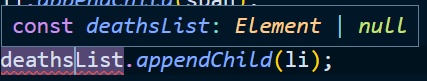

# Typescript_실전

[toc]

## 유틸리티타입

> [유틸리티타입](https://joshua1988.github.io/ts/usage/utility.html)
>
>  이미 정의해 놓은 타입을 변환할 때 사용하기 좋은 타입 문법
>
> 유틸리티 타입을 꼭 쓰지 않더라도 기존의 인터페이스, 제네릭 등의 기본 문법으로 충분히 타입을 변환할 수 있지만 유틸리티 타입을 쓰면 훨씬 더 간결한 문법으로 타입을 정의할 수 있다

### Partial

> 특정 타입의 부분 집합을 만족하는 타입을 정의

```typescript
interface Address {
  email: string;
  address: string;
}

type MayHaveEmail = Partial<Address>;
const me: MayHaveEmail = {}; // 가능
const you: MayHaveEmail = { email: 'test@abc.com' }; // 가능
const all: MayHaveEmail = { email: 'capt@hero.com', address: 'Pangyo' }; // 가능

//
// Partial
type UpdateProduct = Partial<Product>
// 3. 특정 상품 정보를 업데이트(갱신)하는 함수
function updateProductItem(productItem: Partial<Product>) {
// productItem: Product라고 하면 모든 속성을 다 정의해줘야되는데 Partial<Product>는 Product타입의 속성을 전부 옵션으로 처리하게됨(선택적으로 집어 넣을 수 있다)
}

```


- Partial 유틸리티 타입 구현하기

```typescript
// 4. 유틸리티 타입 구현하기 - Partial
interface UserProfile {
  username: string;
  email: string;
  profilePhotoUrl: string;
}
// interface UserProfileUpdate {
//   username?: string;
//   email?: string;
//   profilePhotoUrl?: string;
// }
// #1 유저프로필 인터페이스로 type별칭 만듦 :  유저프로필 인터페이스의 속성을 이용해 type을 정의(옵셔널하게)
// type UserProfileUpdate = {
//   username?: UserProfile['username'];
//   email?: UserProfile['email'];
//   profilePhotoUrl?: UserProfile['profilePhotoUrl'];
// }

// #2(#1을 줄여나감)
type UserProfileUpdate = {
  // 맵드타입(Mapped type) 속성을 반복문처럼 도는데 UserPRofile의 한 키가 [p]에 들어옴, '?' 옵셔널 추가
  [p in 'username' | 'email' | 'profilePhotoUrl']?: UserProfile[p]
}
type UserProfileKeys = keyof UserProfile

// #3
type UserProfileUpdate = {
  // #2의 속성 키들은 'keyof'로 줄일 수 있음, UserProfile의 key들을 하나씩 내보냄
  [p in keyof UserProfile]?: UserProfile[p]
}

// #4 이게 Partial의 구현모습(제너릭이용)
type Subset<T> = {
  [p in keyof T]?: T[p]
}
```


### Pick

>  특정 타입에서 몇 개의 속성을 선택(pick)하여 타입을 정의할 수 있다.

```typescript
// 2. 특정 상품의 상세 정보를 나타내기 위한 함수
// Pick(유틸리티타입) : Product에서 id, name, price를 뽑을거야 -> 이걸 이용해서 interface를 변환해서 쓸 수 있다.
type ShoppingItem = Pick<Product, 'id' | 'name' | 'price'>
function displayProductDetail(shoppingItem: Pick<Product, 'id' | 'name' | 'price'>) {
}
```


### Omit

> 특정 타입에서 지정된 속성만 제거한 타입을 정의함

```typescript
interface AddressBook {
  name: string;
  phone: number;
  address: string;
  company: string;
}
const phoneBook: Omit<AddressBook, 'address'> = {
  name: '재택근무',
  phone: 12342223333,
  company: '내 방'
}
const chingtao: Omit<AddressBook, 'address'|'company'> = {
  name: '중국집',
  phone: 44455557777
}
```

## 맵드 타입(Mapped Type)

> [맵드타입](https://joshua1988.github.io/ts/usage/mapped-type.html#%EB%A7%B5%EB%93%9C-%ED%83%80%EC%9E%85-mapped-type-%EC%9D%B4%EB%9E%80)
>
> 기존에 정의되어 있는 타입을 새로운 타입으로 변환해 주는 문법을 의미한다. 마치 자바스크립트 `map()` API 함수를 타입에 적용한 것과 같은 효과를 가짐

### 맵드 타입의 기본 문법

```typescript
{ [ P in K ] : T }
{ [ P in K ] ? : T }
{ readonly [ P in K ] : T }
{ readonly [ P in K ] ? : T }
```

```typescript
type Heroes = 'Hulk' | 'Capt' | 'Thor'
// Heroes의 각 type들을 반복해서 돌려 :number타입을 정의함
type HeroAges = { [K in Heroes]: number }
const ages: HeroAges = {
  Hulk: 33,
  Capt: 100,
  Thor: 1000,
}

// for in 반복문 코드
// var arr = ['a','b','c'];
// for (var key in arr) {
//   console.log(arr[key]);
// }
```


-------

>[참고 타입스크립트 핸드북](https://joshua1988.github.io/ts/etc/convert-js-to-ts.html#%EC%9E%90%EB%B0%94%EC%8A%A4%ED%81%AC%EB%A6%BD%ED%8A%B8-%ED%94%84%EB%A1%9C%EC%A0%9D%ED%8A%B8%EC%97%90-%ED%83%80%EC%9E%85%EC%8A%A4%ED%81%AC%EB%A6%BD%ED%8A%B8-%EC%A0%81%EC%9A%A9%ED%95%98%EB%8A%94-%EC%A0%88%EC%B0%A8)

## 자바스크립트 코드에 타입스크립트를 적용할 때 주의해야 할 점

- 기능적인 변경은 절대 하지 않을 것
- 테스트 커버리지가 낮을 땐 함부로 타입스크립트를 적용하지 않을 것
- 처음부터 타입을 엄격하게 적용하지 않을 것 (점진적으로 strict 레벨을 증가)

## 자바스크립트 프로젝트에 타입스크립트 적용하는 절차

```sh
TIP

TLDR

1. 타입스크립트 환경 설정 및 ts 파일로 변환
2. any 타입 선언
3. any 타입을 더 적절한 타입으로 변경
```

### 1. 타입스크립트 프로젝트 환경 구성

- 프로젝트 생성 후 NPM 초기화 명령어로 `package.json` 파일을 생성
- 프로젝트 폴더에서 `npm i typescript -D`로 타입스크립트 라이브러리를 설치

```bash
$ npm i typescript -D
# 또는
$ npm i typescript --save-dev
```

- 타입스크립트 설정 파일 `tsconfig.json`을 생성하고 기본 값을 추가

```json
{
  "compilerOptions": {
    // checkJs : @ts-check와 같은 효과를 내는 옵션
    // js 파일을 ts파일로 인식해서 적용하겠다
    "allowJs": true,
    // tsc ts파일을 js(어떤버전)로 바꾸는것
    "target": "ES5",
    // ts결과물이 어디로 들어갈건가?
    "outDir": "./dist",
    // Promise를 인식시켜줌
    "moduleResolution": "Node",
    // ES2015 : async와같은 JS 최근 문법을 쓰기위해 추가
    // DOM, DOM.Iterable : 소스코드 내에서 돔을 조절할것이기 때문에 추가함
    "lib": ["ES2015", "DOM", "DOM.Iterable"],
    // 타입을 정하기 어려운 곳이 있으면 명시적으로 any를 선언해야됨
    "noImplicitAny": true,
    "esModuleInterop": true,
    "typeRoots": ["./node_modules/@types", "./types"]
  },
  // 프로젝트 기준으로 어떤 파일을 ts로 변환할거냐? src폴더 안의 app.js를 바꿈 src폴더안의 모든 파일을 대상으로 하겠다는 뜻
  "include": ["./src/**/*"],
  "exclude": ["node_modules", "dist"]
}
```

- 서비스 코드가 포함된 자바스크립트 파일을 타입스크립트 파일로 변환
- 타입스크립트 컴파일 명령어 `tsc`로 타입스크립트 파일을 자바스크립트 파일로 변환

### 2. 엄격하지 않은 타입 환경(loose type)에서 프로젝트 돌려보기

- 프로젝트에 테스트 코드가 있다면 테스트 코드가 통과하는지 먼저 확인
- 프로젝트의 `js` 파일을 모두 `ts` 파일로 변경(모두 -> 중요한파일먼저 점진적으로 바꿈)
- 타입스크립트 컴파일 에러가 나는 것 위주로만 먼저 에러가 나지 않게 수정
  - 여기서, **기능을 사소하게라도 변경하지 않도록 주의**
- 테스트 코드가 성공하는지 확인합니다.

### 3. 명시적인 `any` 선언하기

- 프로젝트 테스트 코드가 통과하는지 확인
- 타입스크립트 설정 파일(`tsconfig.json`)에 `noImplicitAny: true`를 추가
- 가능한 타입을 적용할 수 있는 모든 곳에 타입을 적용
  - 라이브러리를 쓰는 경우 [DefinitelyTyped](https://definitelytyped.org/)에서 `@types` 관련 라이브러리를 찾아 설치
  - 만약, 타입을 정하기 어려운 곳이 있으면 명시적으로라도 `any`를 선언
- 테스트 코드가 통과하는지 확인

### 4. `strict` 모드 설정하기

- 타입스크립트 설정 파일에 아래 설정을 추가

```json
{
  "strict": true,
  "strictNullChecks": true,
  "strictFunctionTypes": true,
  "strictBindCallApply": true,
  "strictPropertyInitialization": true,
  "noImplicitThis": true,
  "alwaysStrict": true,
}
```

- `any`로 되어 있는 타입을 최대한 더 적절한 타입으로 변환
- `as`와 같은 키워드를 최대한 사용하지 않도록 고민해서 변경


## Projects 코로나 세계 현황

- `README.md`

> ```markdown
> ## 코로나 세계 현황판 만들기
> 
> 최종 프로젝트 폴더입니다
> 
> ## 자바스크립트 프로젝트에 타입스크립트 적용하기
> 
> 0. 자바스크립트 파일에 JSDoc으로 타입 시스템 입히기
> 1. 타입스크립트의 기본 환경 구성
>    - [x] NPM 초기화
>    - [x] 타입스크립트 라이브러리 설치
>    - [x] 타입스크립트 설정 파일 생성 및 기본 값 추가
>    - [x] 자바스크립트 파일을 타입스크립트 파일로 변환
>    - [x] `tsc` 명령어로 타입스크립트 컴파일 하기
> 2. 명시적인 `any` 선언하기
>    - `tsconfig.json` 파일에 `noImplicitAny` 값을 `true`로 추가
>    - 가능한한 구체적인 타입으로 타입 정의
> 3. 프로젝트 환경 구성
>    - babel, eslint, prettier 등의 환경 설정
> 4. 외부 라이브러리 모듈화
> 
> ## 참고 자료
> 
> - [존스 홉킨스 코로나 현황](https://www.arcgis.com/apps/opsdashboard/index.html#/bda7594740fd40299423467b48e9ecf6)
> - [Postman API](https://documenter.getpostman.com/view/10808728/SzS8rjbc?version=latest#27454960-ea1c-4b91-a0b6-0468bb4e6712)
> - [Type Vue without Typescript](https://blog.usejournal.com/type-vue-without-typescript-b2b49210f0b)
> ```
>
> - JSdoc 적용
>
> ```javascript
> // @ts-check
> 
> // api
> // JSdoc으로 기존 js파일에서 ts를 적용하는 법
> /**
>  * 
>  * @typedef {object} CovidSummary
>  * @property {Array<object>} Country
>  */
> 
> /**
>  * 
>  * @returns {Promise<CovidSummary>}
>  */
> function fetchCovidSummary() {
>   const url = 'https://api.covid19api.com/summary';
>   return axios.get(url);
> }
> fetchCovidSummary().then(res => {
>   console.log(res.Country)
> })
> ```
>
> - build를 했을 때 type 에러가 나는것과 runtime 에러가 나는건 독립적임, type에러는 홈페이지에 영향이 있는게 아니다->홈페이지는 돌아감

### 타입스크립트 프로젝트 환경 구성

> 1. 프로젝트 폴더 생성
>
> 2. `npm init -y`로 `package.json` 파일 생성
>
> 3. 아래 명령어로 타입스크립트 및 문법 검사(ESLint), 코드 정리 도구(prettier) 라이브러리 추가
>
> - babel : 최신 자바스크립트 문법을 오래된 브라우저에서도 호환가능한 자바스크립트로 변환해주는 도구
> - ESLint : 자바스크립트 코드를 에러가 덜 나는 방향으로 작성하도록 도와주는 문법 보조 도구
>
> ```sh
> $ npm i -D typescript @babel/core @babel/preset-env @babel/preset-typescript @typescript-eslint/eslint-plugin @typescript-eslint/parser eslint prettier eslint-plugin-prettier
> ```
>
> - `package.json`에 depedencies에 typescript가 있으면 uninstall 한 뒤 위 코드를 적어 devdependencies로 깔아야됨
> - dependencies : 배포에 포함되는 라이브러리, devdependencies : 배포에 포함되지 않는 라이브러리
>
> 4. 프로젝트 폴더 바로 아래에 ESLint 설정 파일 추가 
>
> > `.eslintrc.js` 앞의 `.`은 숨김파일이란 뜻이고, `rc`는 설정파일이란 뜻, `js,json, yml`의 확장자를 가질 수 있는데 js는 주석, 다른 파일내용 병합가능해서 js를 선호함(개인적의견) 
>
> ```js
> // .eslintrc.js
> module.exports = {
>   root: true,
>   env: {
>     browser: true,
>     node: true,
>   },
>   extends: [
>     'eslint:recommended',
>     'plugin:@typescript-eslint/eslint-recommended',
>     'plugin:@typescript-eslint/recommended',
>   ],
>   plugins: ['prettier', '@typescript-eslint'],
>   rules: {
>     'prettier/prettier': [
>      // 규칙에 안맞으면 error('빨간줄')로 간주함('warn' : 노란줄 쳐짐) 
>      'error',
>       {
>         singleQuote: true,
>         semi: true, // ';' : 세미콜론
>         useTabs: false,
>         tabWidth: 2, // tab간격
>         printWidth: 80,
>         bracketSpacing: true,
>         arrowParens: 'avoid',
>       },
>     ],
>   },
>   parserOptions: {
>     parser: '@typescript-eslint/parser',
>   },
> };
> ```
>
> 5. ESLint 이그노어 파일 추가
>
> - `.eslintignore` : eslint의 대상이되지 않는 것
>
> ```
> // .eslintignore
> 
> node_modules
> dist
> ```

### VSCode ESLint 플러그인 관련 설정

> 1. VSCode의 [ESLint 플러그인](https://marketplace.visualstudio.com/items?itemName=dbaeumer.vscode-eslint) 설치
>
> 2. VSCode에서 `ctrl` + `shift` + `p` / `cmd` + `shift` + `p` 키를 이용하여 명령어 실행 창 표시
>
> 3. 명령어 실행 창에 `open settings (json)` 입력 후 선택
>
> 
>
> 4. VSCode 사용자 정의 파일인 `settings.json` 파일의 내용에 아래와 같이 ESLint 플러그인 관련 설정 추가.
>
> ```js
> {
>   // ... <-- 기존 내용을 꼭 유지한 상태에서 아래 내용을 추가하고 이 주석은 제거할 것
>   "editor.codeActionsOnSave": {
>       "source.fixAll.eslint": true
>   },
>   "eslint.alwaysShowStatus": true,
>   "eslint.workingDirectories": [
>       {"mode": "auto"}
>   ],
>   "eslint.validate": [
>       "javascript",
>       "typescript"
>   ]
> }
> ```
>
> 5. `ctrl` + `,` 또는 `cmd` + `,` 눌러서 VSCode 설정 파일(Settings)에 들어간 후 `format on save` 검색. 아래와 같이 체크가 안되어 있는지 확인.
>
> 
>
> 이렇게 설정을 하면 `app.ts`에 `var a = 10;`이라고 쓰면 `const a = 10;` 

### WHY tslint가 아닌 eslint를 쓰는가?

> - tslint보다 eslint의 성능이 더 좋음

### 외부라이브러리 모듈화

> - npm 으로 설치
>
> ```sh
> $ npm i axios
> ```
>
> - `app.ts` 에 import해줌
>
> ```typescript
> import axios from 'axios';
> ```
>
> - chart.js npm 설치
>
> ```sh
> $ npm install chart.js
> ```
>
> - chart.js는 `app.ts`에 import하려고 해도 안됨 typescript에서 인식이 안됨

### typescript에서 인식되지 않는 외부라이브러리 설정방법

> - 해당 라이브러리 `alt`누른뒤 누르면 `node_modules`폴더안의 해당 라이브러리 폴더로 이동함
> - axios는 ts로 변환된 파일이 같이 폴더에 들어있기 때문에 에러가 나지 않았고, `chart.js`는 js파일 밖에 없어서 에러가 났다
> - 이랬을 때 에러코드에 `npm install --save @types/chartjs`를 하라고 뜸! 이 코드를 검색을 통해 npm 공식문서에 검색해 보면 `npm install @types/chart.js --save-dev`라는 코드를 써야된다고 뜬다 그럼 이걸 깔아주면 됨
>
> ```sh
> $ npm install @types/chart.js --save-dev
> ```
>
> - 이렇게 하면 `app.ts`에서 import 하는 'chart.js' 에 에러가안남(해당 라이브러리의 ts 선언 파일을 설치 : `node_modules > @types > '해당 라이브러리 폴더' > index.d.ts`)
> - axios는 잘만들어진 api이기 때문에 내부적으로 `index.d.ts`파일이 없지만 대다수의 라이브러리는 이게 없어서 이렇게 검색하고 따로 설치가 필요하다

### Definitly Typed(`@types/`)

> [Definitly Typed Github](https://github.com/DefinitelyTyped/DefinitelyTyped)
>
> [Typescript npm 공식사이트](https://www.typescriptlang.org/dt/search?search=)
>
> - javascript 라이브러리를 typescript에 적용시킴 `@types/`

### `@types`가 제공되지 않는 외부라이브러리 적용 방법

> - 없다면 직접 `index.d.ts`파일을 만들어서 적용시켜줘야됨
> - `tsconfig.json`파일에 `typeRoots`를 설정해줌
>
> ```json
> {
>      // typeRoots는 따로 설정해주지 않으면 "./node_modules/@types" 이게 기본 경로(@types 안의 폴더를 다 뒤져서 index.d.ts파일을 읽음),거기에 types라고 내가 정의한 폴더를 추가해서 라이브러리 이름으로 폴더를 만든 뒤 'index.d.ts'파일을 만들어서 설정해줌
>     "typeRoots": ["./node_modules/@types", "./types"]
> }
> ```
>
> - `types/chart.js/index.d.ts`
>
> ```typescript
> declare module 'chart.js' {
>     // .. 구체적 내용 설정 가능함
> }
> ```

### api함수 typescript

> type을 따로 파일로 만들어서 export함

- `covid > index.ts`

```typescript
export interface Country {
  Country: string;
  CountryCode: string;
  Date: string;
  NewConfirmed: number;
  NewDeaths: number;
  NewRecovered: number;
  Premium: any; // {} object의 안 구조를 알 수 없어서 any로 함
  Slug: string;
  TotalConfirmed: number;
  TotalDeaths: number;
  TotalRecovered: number;
}

interface Global {
  NewConfirmed: number;
  NewDeaths: number;
  NewRecovered: number;
  TotalConfirmed: number;
  TotalDeaths: number;
  TotalRecovered: number;
}
// CovidSummary에서 받아온 정보를 interface로 정의
export interface CovidSummaryResponse {
  Countries: Country[];
  Date: string;
  Global: Global;
  Message: string;
}

export interface CountrySummaryInfo {
  Cases: number;
  City: string;
  CityCode: string;
  Country: string;
  CountryCode: string;
  Date: string;
  Lat: string;
  Lon: string;
  Province: string;
  Status: string;
}

// CountrySummaryInfo를 배열로 갖는 type정의
export type CountrySummaryResponse = CountrySummaryInfo[];

```


- `index.html`

```html
<!DOCTYPE html>
<html lang="en">
  <head>
    <meta charset="UTF-8" />
    <meta name="viewport" content="width=device-width, initial-scale=1.0" />
    <title>코로나 세계 현황</title>
    <link
      href="https://fonts.googleapis.com/css?family=Exo+2&display=swap"
      rel="stylesheet"
    />
    <link rel="stylesheet" href="./main.css" />
  </head>
  <body>
    <header class="flex justify-center">
      <h1>코로나 세계 현황판</h1>
    </header>
    <main class="flex">
      <div class="left-panel flex column">
        <div class="total-board">
          <p>Total Confirmed</p>
          <span class="confirmed-total"></span>
        </div>
        <div class="country-ranks">
          <p>Confirmed Cases by Country</p>
          <ol class="rank-list"></ol>
        </div>
        <p class="last-updated-time flex justify-center align-center"></p>
      </div>
      <div class="right-panel">
        <div class="summary-wrapper flex">
          <div class="deaths-container">
            <h3 class="summary-title">Total Deaths</h3>
            <p class="total deaths">0</p>
            <div class="list-wrapper">
              <ol class="deaths-list"></ol>
            </div>
          </div>
          <div class="recovered-container">
            <h3 class="summary-title">Total Recovered</h3>
            <p class="total recovered">0</p>
            <div class="list-wrapper">
              <ol class="recovered-list"></ol>
            </div>
          </div>
        </div>
        <div class="chart-container">
          <canvas
            id="lineChart"
            class="corona-chart"
            style="width: 100%; height: 356px; background-color: #5b5656;"
          ></canvas>
        </div>
      </div>
    </main>
    <script src="https://unpkg.com/axios/dist/axios.min.js"></script>
    <script src="https://cdn.jsdelivr.net/npm/chart.js@2.8.0"></script>
    <script src="./dist/app.js"></script>
  </body>
</html>

```

- `app.ts`

```typescript
// // 라이브러리 로딩
// import 변수명 from '라이브러리 이름';
// // 변수, 함수 임포트 문법
// import {} from '파일 상대 경로';
// axios의 응답으로 오는 type이 AxiosResponse 반환값 Promise<AxiosResponse<any>> 이런식으로 type을 적음
import axios, { AxiosResponse } from 'axios';
import Chart from 'chart.js';
// import * as Chart from 'chart.js; //몇몇 라이브러리는 이렇게 적어줘야 에러가
// 타입 모듈
import {
  CountrySummaryResponse,
  CovidSummaryResponse,
  Country,
  CountrySummaryInfo,
} from './covid/index';

// utils
// document.querySelctor는 $로 사용가능하게 함
function $(selector: string) {
  return document.querySelector(selector);
}
// 이미 기존에 있는 type(new Date)이기때문에 Date | string | number 이라고 type을 정의할 수있음, 대부분 Date는 string으로 들어올 수 있어서 string타입까지 받게 하면됨
function getUnixTimestamp(date: Date | string) {
  return new Date(date).getTime();
}
// DOM
// let a: Element | HTMLElement | HTMLParagraphElement;
// as : 타입단언, 달러표시의 결과가 어떤 타입(확장됨) 인지 단언함
// 어떤태그의 확장된 element인지 index.html에서 보고 서로 타입간 호환할수있는형태로 타입을 정해줌
const confirmedTotal = $('.confirmed-total') as HTMLSpanElement;
const deathsTotal = $('.deaths') as HTMLParagraphElement;
const recoveredTotal = $('.recovered') as HTMLParagraphElement;
const lastUpdatedTime = $('.last-updated-time') as HTMLParagraphElement;
const rankList = $('.rank-list');
const deathsList = $('.deaths-list');
const recoveredList = $('.recovered-list');
const deathSpinner = createSpinnerElement('deaths-spinner');
const recoveredSpinner = createSpinnerElement('recovered-spinner');

// 로딩되고있다고 인지시켜주는 spinner
function createSpinnerElement(id: string) {
  const wrapperDiv = document.createElement('div');
  wrapperDiv.setAttribute('id', id);
  wrapperDiv.setAttribute(
    'class',
    'spinner-wrapper flex justify-center align-center'
  );
  const spinnerDiv = document.createElement('div');
  spinnerDiv.setAttribute('class', 'ripple-spinner');
  spinnerDiv.appendChild(document.createElement('div'));
  spinnerDiv.appendChild(document.createElement('div'));
  wrapperDiv.appendChild(spinnerDiv);
  return wrapperDiv;
}

// state
let isDeathLoading = false;

// api
function fetchCovidSummary(): Promise<AxiosResponse<CovidSummaryResponse>> {
  const url = 'https://api.covid19api.com/summary';
  return axios.get(url);
}

enum CovidStatus {
  Confirmed = 'confirmed',
  Recovered = 'recovered',
  Deaths = 'deaths',
}

function fetchCountryInfo(
  countryName: string,
  status: CovidStatus // enum
): Promise<AxiosResponse<CountrySummaryResponse>> {
  // status params: confirmed, recovered, deaths
  const url = `https://api.covid19api.com/country/${countryName}/status/${status}`;
  return axios.get(url);
}

// methods
function startApp() {
  setupData();
  initEvents();
}

// events
function initEvents() {
  rankList.addEventListener('click', handleListClick);
}

// async -> js를 ts로 바꿀 때 오류가 남 -> 컴파일 옵션추가(lib : ES2015)
async function handleListClick(event: MouseEvent) {
  let selectedId;
  if (
    event.target instanceof HTMLParagraphElement ||
    event.target instanceof HTMLSpanElement
  ) {
    selectedId = event.target.parentElement.id;
  }
  if (event.target instanceof HTMLLIElement) {
    selectedId = event.target.id;
  }
  if (isDeathLoading) {
    return;
  }
  clearDeathList();
  clearRecoveredList();
  startLoadingAnimation();
  isDeathLoading = true;
  const { data: deathResponse } = await fetchCountryInfo(
    selectedId,
    // enum의 Deaths값을 넘겨줌(CovidStatus가 enum으로 돼있고 안에 어떤 속성이 있는지 자동완성으로 알 수 있다)
    CovidStatus.Deaths
  );
  const { data: recoveredResponse } = await fetchCountryInfo(
    selectedId,
    CovidStatus.Recovered
  );
  const { data: confirmedResponse } = await fetchCountryInfo(
    selectedId,
    CovidStatus.Confirmed
  );
  endLoadingAnimation();
  setDeathsList(deathResponse);
  setTotalDeathsByCountry(deathResponse);
  setRecoveredList(recoveredResponse);
  setTotalRecoveredByCountry(recoveredResponse);
  setChartData(confirmedResponse);
  isDeathLoading = false;
}
// data가 CountrySummaryResponse 타입이면 CountrySummaryResponsesms  CountrySummaryInfo 이루어진 배열이기 떄문에 안의 a,b 요소는 CountrySummaryInfo 타입이 된다
function setDeathsList(data: CountrySummaryResponse) {
  const sorted = data.sort(
    (a: CountrySummaryInfo, b: CountrySummaryInfo) =>
      getUnixTimestamp(b.Date) - getUnixTimestamp(a.Date)
  );
  sorted.forEach((value: CountrySummaryInfo) => {
    const li = document.createElement('li');
    li.setAttribute('class', 'list-item-b flex align-center');
    const span = document.createElement('span');
    // span의 textContent는 string인데 value의 Cases는 number이기 때문에 type을 맞추기 위해 toString으로 맞춰줌
    span.textContent = value.Cases.toString();
    span.setAttribute('class', 'deaths');
    const p = document.createElement('p');
    p.textContent = new Date(value.Date).toLocaleDateString().slice(0, -1);
    li.appendChild(span);
    li.appendChild(p);
    deathsList.appendChild(li);
  });
}

function clearDeathList() {
  deathsList.innerHTML = null;
}

function setTotalDeathsByCountry(data: CountrySummaryResponse) {
  // deathsTotal은 위에 class deaths로 잡은 DOM Element
  deathsTotal.innerText = data[0].Cases.toString();
}

function setRecoveredList(data: CountrySummaryResponse) {
  const sorted = data.sort(
    (a: CountrySummaryInfo, b: CountrySummaryInfo) =>
      getUnixTimestamp(b.Date) - getUnixTimestamp(a.Date)
  );
  sorted.forEach((value: CountrySummaryInfo) => {
    const li = document.createElement('li');
    li.setAttribute('class', 'list-item-b flex align-center');
    const span = document.createElement('span');
    span.textContent = value.Cases.toString();
    span.setAttribute('class', 'recovered');
    const p = document.createElement('p');
    p.textContent = new Date(value.Date).toLocaleDateString().slice(0, -1);
    li.appendChild(span);
    li.appendChild(p);
    recoveredList.appendChild(li);
  });
}

function clearRecoveredList() {
  recoveredList.innerHTML = null;
}

function setTotalRecoveredByCountry(data: CountrySummaryResponse) {
  recoveredTotal.innerText = data[0].Cases.toString();
}

function startLoadingAnimation() {
  deathsList.appendChild(deathSpinner);
  recoveredList.appendChild(recoveredSpinner);
}

function endLoadingAnimation() {
  deathsList.removeChild(deathSpinner);
  recoveredList.removeChild(recoveredSpinner);
}

async function setupData() {
  const { data } = await fetchCovidSummary();
  setTotalConfirmedNumber(data);
  setTotalDeathsByWorld(data);
  setTotalRecoveredByWorld(data);
  setCountryRanksByConfirmedCases(data);
  setLastUpdatedTimestamp(data);
}
//   renderChart(chartData, chartLabel);이렇게 보낼때 data는 number 배열, label은 string배열
function renderChart(data: number[], labels: string[]) {
  // 방법 2개 있음 아래처럼 lineChart를 따로 분리해서 타입단언 해도되고, ctx에서 바로 타입단언을 해줘도됨
  const lineChart = $('#lineChart') as HTMLCanvasElement;
  const ctx = lineChart.getContext('2d');
  Chart.defaults.global.defaultFontColor = '#f5eaea';
  Chart.defaults.global.defaultFontFamily = 'Exo 2';
  new Chart(ctx, {
    type: 'line',
    data: {
      labels,
      datasets: [
        {
          label: 'Confirmed for the last two weeks',
          backgroundColor: '#feb72b',
          borderColor: '#feb72b',
          data,
        },
      ],
    },
    options: {},
  });
}

function setChartData(data: CountrySummaryResponse) {
  const chartData = data
    .slice(-14) // 최근 14일(2주)
    .map((value: CountrySummaryInfo) => value.Cases);
  const chartLabel = data
    .slice(-14)
    .map((value: CountrySummaryInfo) =>
      new Date(value.Date).toLocaleDateString().slice(5, -1)
    );
  renderChart(chartData, chartLabel);
}

function setTotalConfirmedNumber(data: CovidSummaryResponse) {
  confirmedTotal.innerText = data.Countries.reduce(
    // 각 요소를 더해서 누적해나감
    (total: number, current: Country) => (total += current.TotalConfirmed),
    // 초기값은 0
    0
  ).toString(); // 안의 값이 숫자! 문자로 바꾸는 api가 toString()
}

function setTotalDeathsByWorld(data: CovidSummaryResponse) {
  deathsTotal.innerText = data.Countries.reduce(
    (total: number, current: Country) => (total += current.TotalDeaths),
    0
  ).toString();
}

function setTotalRecoveredByWorld(data: CovidSummaryResponse) {
  recoveredTotal.innerText = data.Countries.reduce(
    (total: number, current: Country) => (total += current.TotalRecovered),
    0
  ).toString();
}

function setCountryRanksByConfirmedCases(data: CovidSummaryResponse) {
  const sorted = data.Countries.sort(
    (a: Country, b: Country) => b.TotalConfirmed - a.TotalConfirmed
  );
  sorted.forEach((value: Country) => {
    const li = document.createElement('li');
    li.setAttribute('class', 'list-item flex align-center');
    li.setAttribute('id', value.Slug);
    const span = document.createElement('span');
    span.textContent = value.TotalConfirmed.toString();
    span.setAttribute('class', 'cases');
    const p = document.createElement('p');
    p.setAttribute('class', 'country');
    p.textContent = value.Country;
    li.appendChild(span);
    li.appendChild(p);
    rankList.appendChild(li);
  });
}

function setLastUpdatedTimestamp(data: CovidSummaryResponse) {
  lastUpdatedTime.innerText = new Date(data.Date).toLocaleString();
}

startApp();

```

- typescript를 다 작성했으면`npm run build`(`package.json`파일에 `"build : "webpack"`으로 설정했기 때문에 build명령어 사용)를 함 -> `tsconfig.json`에 `"outDir" : "./dist"`라고 했기 때문에 dist폴더아래에 `app.js`파일이 생김 (`.eslintignore`파일에 dist폴더도 추가해야됨 : node_modules와 함께 읽어지면 안되는 파일이라 설정해줌)


### (참고) Destructuring

> [구조분해문법](https://joshua1988.github.io/vue-camp/es6/destructuring.html#%EA%B8%B0%EC%A1%B4-%EC%9E%90%EB%B0%94%EC%8A%A4%ED%81%AC%EB%A6%BD%ED%8A%B8%EC%97%90%EC%84%9C%EC%9D%98-%EA%B5%AC%EC%A1%B0)

```js
var josh = {
  language: 'javascript',
  position: 'front-end',
  area: 'pangyo',
  hobby: 'singing',
  age: '102'
};

var { language, position, area, hobby, age } = josh;
console.log(language); // javascript
console.log(position); // front-end
console.log(area); // pangyo
console.log(hobby); // singing
console.log(age); // 102
```

### strict 옵션

> `tsconfig.json`에 설정
>
> - 타입스크립트 설정 파일에 아래 설정을 추가(강하게 타입을 설정함)
>
> ```json
> {
>   "strict": true, 
>     //위 strict를 true로 하면 아래 옵션들이 모두 true로 자동으로 적용됨
>   "strictNullChecks": true, // null 값 체크
>   "strictFunctionTypes": true, // callback으로 보내는 function의 타입까지 엄격하게 검사
>   "strictBindCallApply": true,
>   "strictPropertyInitialization": true,
>   "noImplicitThis": true,
>   "alwaysStrict": true,
> }
> ```
>
> - `any`로 되어 있는 타입을 최대한 더 적절한 타입으로 변환
> - `as`와 같은 키워드를 최대한 사용하지 않도록 고민해서 변경

- `app.ts` strict옵션 적용시 type을 더 정확하게 처리하고 null값도 처리해야됨





- 타입단언 

> `!` 보단 `?`를 사용해라

```typescript
interface Hero {
  name: string;
  skill: string;
}

// : type annotation
// const capt: Hero = {
//   name: 'capt',
//   skill: 'sheild',
// };
// const capt: Hero = {};

// as : 타입단언은 주의해서 써야된다
const capt = {} as Hero;
// 아래의 name과 skill을 정의하지 않고 capt만 선언해도 오류가 나지 않음 추후에 문제가 될 수 있음
capt.name = 'capt';
capt.skill = 'shild';

// ! : non null 타입단언
const a: string | null;
// a가 null이 아닐거라고 단언을 하면 문제가 될 수 있음(null이 안들어온다는 확신이 있을 때 사용해야됨)
// a!;

// ? : 옵셔널 체이닝 오퍼레이터
    // if (recoveredList == null || recoveredList === undefined) {
    //   return;
    // } else {
    //   recoveredList.appendChild(li);
    // }
    // ? 는 위 주석 코드를 한줄로 줄인것!
    recoveredList?.appendChild(li);
```

- `app.ts`수정

```typescript
// // 라이브러리 로딩
// import 변수명 from '라이브러리 이름';
// // 변수, 함수 임포트 문법
// import {} from '파일 상대 경로';
// axios의 응답으로 오는 type이 AxiosResponse 반환값 Promise<AxiosResponse<any>> 이런식으로 type을 적음
import axios, { AxiosResponse } from 'axios';
import Chart from 'chart.js';
// import * as Chart from 'chart.js; //몇몇 라이브러리는 이렇게 적어줘야 에러가
// 타입 모듈
import {
  CountrySummaryResponse,
  CovidSummaryResponse,
  Country,
  CountrySummaryInfo,
} from './covid/index';

// utils
// document.querySelctor는 $로 사용가능하게 함
function $(selector: string) {
  return document.querySelector(selector);
}
// T extends HTMLHtmlElement = HTMLDivElement은 type을 받지 않는다면 default값으로 type을 HTMLDivElement로 지정해줄 수 있다
// function $<T extends HTMLHtmlElement = HTMLDivElement>(selector: string) {
//   const element = document.querySelector(selector);
//   // DOM접근함수로 넘겼던 type으로 return될거라고 단언할 수 있다 그러면 아래 변수를 선언할 때 as로 단언하지 않아도 됨!
//   // 여기서 주의할 점은 오타를 주의할 것! -> 이렇게 쓰는게 더 유용
//   return element as T;
// }
// 예시
// const temp = $<HTMLParagraphElement>('.abc');

// 이미 기존에 있는 type(new Date)이기때문에 Date | string | number 이라고 type을 정의할 수있음, 대부분 Date는 string으로 들어올 수 있어서 string타입까지 받게 하면됨
function getUnixTimestamp(date: Date | string) {
  return new Date(date).getTime();
}
// DOM
// let a: Element | HTMLElement | HTMLParagraphElement;
// as : 타입단언, 달러표시의 결과가 어떤 타입(확장됨) 인지 단언함
// 어떤태그의 확장된 element인지 index.html에서 보고 서로 타입간 호환할수있는형태로 타입을 정해줌
const confirmedTotal = $('.confirmed-total') as HTMLSpanElement;
const deathsTotal = $('.deaths') as HTMLParagraphElement;
const recoveredTotal = $('.recovered') as HTMLParagraphElement;
const lastUpdatedTime = $('.last-updated-time') as HTMLParagraphElement;
//strict as로 정확한 type을 단언하지 않아서 아래 해당 변수를 사용한 코드가 에러가 남 -> HTMLOListElement로 type을 단언해줌
// const rankList = $('.rank-list');
const rankList = $('.rank-list') as HTMLOListElement;
// const deathsList = $('.deaths-list');
const deathsList = $('.deaths-list') as HTMLOListElement;
// const recoveredList = $('.recovered-list');
const recoveredList = $('.recovered-list') as HTMLOListElement;
const deathSpinner = createSpinnerElement('deaths-spinner');
const recoveredSpinner = createSpinnerElement('recovered-spinner');

// 로딩되고있다고 인지시켜주는 spinner
function createSpinnerElement(id: string) {
  const wrapperDiv = document.createElement('div');
  wrapperDiv.setAttribute('id', id);
  wrapperDiv.setAttribute(
    'class',
    'spinner-wrapper flex justify-center align-center'
  );
  const spinnerDiv = document.createElement('div');
  spinnerDiv.setAttribute('class', 'ripple-spinner');
  spinnerDiv.appendChild(document.createElement('div'));
  spinnerDiv.appendChild(document.createElement('div'));
  wrapperDiv.appendChild(spinnerDiv);
  return wrapperDiv;
}

// state
let isDeathLoading = false;

// api
function fetchCovidSummary(): Promise<AxiosResponse<CovidSummaryResponse>> {
  const url = 'https://api.covid19api.com/summary';
  return axios.get(url);
}

enum CovidStatus {
  Confirmed = 'confirmed',
  Recovered = 'recovered',
  Deaths = 'deaths',
}

function fetchCountryInfo(
  // countryName: string,
  // strict
  countryName: string | undefined,
  status: CovidStatus // enum
): Promise<AxiosResponse<CountrySummaryResponse>> {
  // status params: confirmed, recovered, deaths
  const url = `https://api.covid19api.com/country/${countryName}/status/${status}`;
  return axios.get(url);
}

// methods
function startApp() {
  setupData();
  initEvents();
}

// events
function initEvents() {
  // strict를 설정했을 때 null값처리
  if (!rankList) {
    return;
  }
  rankList.addEventListener('click', handleListClick);
}

// async -> js를 ts로 바꿀 때 오류가 남 -> 컴파일 옵션추가(lib : ES2015)
// (상위) Element > HTMLElement > HTMLDivElement (하위) 순으로 확장됨
// Event > UIEvent > MouseEvent 순으로 확장됨
// strict옵션 = event : MouseEvent -> Event로 바꿔야에러가 사라짐 WHY?? MouseEvent는 Event에서 확장된 것이기 때문에 strict는 정확한 type을 써줘야돼서 Event로 type을 변경함
async function handleListClick(event: Event) {
  let selectedId;
  if (
    event.target instanceof HTMLParagraphElement ||
    event.target instanceof HTMLSpanElement
  ) {
    // selectedId = event.target.parentElement.id;
    // strict : 위 코드를 삼항연산자로 null값처리
    selectedId = event.target.parentElement
      ? event.target.parentElement.id
      : undefined;
  }
  if (event.target instanceof HTMLLIElement) {
    selectedId = event.target.id;
  }
  if (isDeathLoading) {
    return;
  }
  clearDeathList();
  clearRecoveredList();
  startLoadingAnimation();
  isDeathLoading = true;
  const { data: deathResponse } = await fetchCountryInfo(
    selectedId,
    // enum의 Deaths값을 넘겨줌(CovidStatus가 enum으로 돼있고 안에 어떤 속성이 있는지 자동완성으로 알 수 있다)
    CovidStatus.Deaths
  );
  const { data: recoveredResponse } = await fetchCountryInfo(
    selectedId,
    CovidStatus.Recovered
  );
  const { data: confirmedResponse } = await fetchCountryInfo(
    selectedId,
    CovidStatus.Confirmed
  );
  endLoadingAnimation();
  setDeathsList(deathResponse);
  setTotalDeathsByCountry(deathResponse);
  setRecoveredList(recoveredResponse);
  setTotalRecoveredByCountry(recoveredResponse);
  setChartData(confirmedResponse);
  isDeathLoading = false;
}
// data가 CountrySummaryResponse 타입이면 CountrySummaryResponsesms  CountrySummaryInfo 이루어진 배열이기 떄문에 안의 a,b 요소는 CountrySummaryInfo 타입이 된다
function setDeathsList(data: CountrySummaryResponse) {
  const sorted = data.sort(
    (a: CountrySummaryInfo, b: CountrySummaryInfo) =>
      getUnixTimestamp(b.Date) - getUnixTimestamp(a.Date)
  );
  sorted.forEach((value: CountrySummaryInfo) => {
    const li = document.createElement('li');
    li.setAttribute('class', 'list-item-b flex align-center');
    const span = document.createElement('span');
    // span의 textContent는 string인데 value의 Cases는 number이기 때문에 type을 맞추기 위해 toString으로 맞춰줌
    span.textContent = value.Cases.toString();
    span.setAttribute('class', 'deaths');
    const p = document.createElement('p');
    p.textContent = new Date(value.Date).toLocaleDateString().slice(0, -1);
    li.appendChild(span);
    li.appendChild(p);
    // if (!deathsList) {
    // return;
    // 매번 이렇게 null값처리를 할 수없으니 변수를 선언할때 type을 제대로 선언해줌
    // }
    //  !(non null 타입단언) : 이건 null이 아니다 라고 단언하는 것
    deathsList!.appendChild(li);
  });
}

function clearDeathList() {
  deathsList.innerHTML = '';
  // deathsList.innerHTML = null;
}

function setTotalDeathsByCountry(data: CountrySummaryResponse) {
  // deathsTotal은 위에 class deaths로 잡은 DOM Element
  deathsTotal.innerText = data[0].Cases.toString();
}

function setRecoveredList(data: CountrySummaryResponse) {
  const sorted = data.sort(
    (a: CountrySummaryInfo, b: CountrySummaryInfo) =>
      getUnixTimestamp(b.Date) - getUnixTimestamp(a.Date)
  );
  sorted.forEach((value: CountrySummaryInfo) => {
    const li = document.createElement('li');
    li.setAttribute('class', 'list-item-b flex align-center');
    const span = document.createElement('span');
    span.textContent = value.Cases.toString();
    span.setAttribute('class', 'recovered');
    const p = document.createElement('p');
    p.textContent = new Date(value.Date).toLocaleDateString().slice(0, -1);
    li.appendChild(span);
    li.appendChild(p);
    // ? : 옵셔널 체이닝 오퍼레이터
    // if (recoveredList == null || recoveredList === undefined) {
    //   return;
    // } else {
    //   recoveredList.appendChild(li);
    // }
    // ? 는 위 주석 코드를 한줄로 줄인것!
    recoveredList?.appendChild(li);
  });
}

function clearRecoveredList() {
  // recoveredList.innerHTML = null;
  recoveredList.innerHTML = '';
}

function setTotalRecoveredByCountry(data: CountrySummaryResponse) {
  recoveredTotal.innerText = data[0].Cases.toString();
}

function startLoadingAnimation() {
  deathsList.appendChild(deathSpinner);
  recoveredList.appendChild(recoveredSpinner);
}

function endLoadingAnimation() {
  deathsList.removeChild(deathSpinner);
  recoveredList.removeChild(recoveredSpinner);
}

async function setupData() {
  const { data } = await fetchCovidSummary();
  setTotalConfirmedNumber(data);
  setTotalDeathsByWorld(data);
  setTotalRecoveredByWorld(data);
  setCountryRanksByConfirmedCases(data);
  setLastUpdatedTimestamp(data);
}
//   renderChart(chartData, chartLabel);이렇게 보낼때 data는 number 배열, label은 string배열
function renderChart(data: number[], labels: string[]) {
  // 방법 2개 있음 아래처럼 lineChart를 따로 분리해서 타입단언 해도되고, ctx에서 바로 타입단언을 해줘도됨
  const lineChart = $('#lineChart') as HTMLCanvasElement;
  const ctx = lineChart.getContext('2d');
  Chart.defaults.global.defaultFontColor = '#f5eaea';
  Chart.defaults.global.defaultFontFamily = 'Exo 2';
  new Chart(ctx, {
    type: 'line',
    data: {
      labels,
      datasets: [
        {
          label: 'Confirmed for the last two weeks',
          backgroundColor: '#feb72b',
          borderColor: '#feb72b',
          data,
        },
      ],
    },
    options: {},
  });
}

function setChartData(data: CountrySummaryResponse) {
  const chartData = data
    .slice(-14) // 최근 14일(2주)
    .map((value: CountrySummaryInfo) => value.Cases);
  const chartLabel = data
    .slice(-14)
    .map((value: CountrySummaryInfo) =>
      new Date(value.Date).toLocaleDateString().slice(5, -1)
    );
  renderChart(chartData, chartLabel);
}

function setTotalConfirmedNumber(data: CovidSummaryResponse) {
  confirmedTotal.innerText = data.Countries.reduce(
    // 각 요소를 더해서 누적해나감
    (total: number, current: Country) => (total += current.TotalConfirmed),
    // 초기값은 0
    0
  ).toString(); // 안의 값이 숫자! 문자로 바꾸는 api가 toString()
}

function setTotalDeathsByWorld(data: CovidSummaryResponse) {
  deathsTotal.innerText = data.Countries.reduce(
    (total: number, current: Country) => (total += current.TotalDeaths),
    0
  ).toString();
}

function setTotalRecoveredByWorld(data: CovidSummaryResponse) {
  recoveredTotal.innerText = data.Countries.reduce(
    (total: number, current: Country) => (total += current.TotalRecovered),
    0
  ).toString();
}

function setCountryRanksByConfirmedCases(data: CovidSummaryResponse) {
  const sorted = data.Countries.sort(
    (a: Country, b: Country) => b.TotalConfirmed - a.TotalConfirmed
  );
  sorted.forEach((value: Country) => {
    const li = document.createElement('li');
    li.setAttribute('class', 'list-item flex align-center');
    li.setAttribute('id', value.Slug);
    const span = document.createElement('span');
    span.textContent = value.TotalConfirmed.toString();
    span.setAttribute('class', 'cases');
    const p = document.createElement('p');
    p.setAttribute('class', 'country');
    p.textContent = value.Country;
    li.appendChild(span);
    li.appendChild(p);
    rankList.appendChild(li);
  });
}

function setLastUpdatedTimestamp(data: CovidSummaryResponse) {
  lastUpdatedTime.innerText = new Date(data.Date).toLocaleString();
}

startApp();

```

### utils

```typescript
// utils
// 1번째 방법
// document.querySelctor는 $로 사용가능하게 함
function $(selector: string) {
  return document.querySelector(selector);
}

// 2번째 방법 제네릭 이용
// T extends HTMLHtmlElement = HTMLDivElement은 type을 받지 않는다면 default값으로 type을 HTMLDivElement로 지정해줄 수 있다
function $<T extends HTMLHtmlElement = HTMLDivElement>(selector: string) {
  const element = document.querySelector(selector);
  // DOM접근함수로 넘겼던 type으로 return될거라고 단언할 수 있다 그러면 아래 변수를 선언할 때 as로 단언하지 않아도 됨!
  // 여기서 주의할 점은 오타를 주의할 것! -> 이렇게 쓰는게 더 유용
  return element as T;
}
// 2번 예시
const temp = $<HTMLParagraphElement>('.abc');
//1번
const confirmedTotal = $('.confirmed-total') as HTMLSpanElement;
// 2번
const confirmedTotal = $<HTMLSpanElement>('.confirmed-total');
// 1번
const deathsTotal = $('.deaths') as HTMLParagraphElement;
// 2번
const deathsTotal = $<HTMLParagraphElement>('.deaths');
// 1번
const recoveredTotal = $('.recovered') as HTMLParagraphElement;
// 2번
const recoveredTotal = $<HTMLParagraphElement>('.recovered');
// 1번
const lastUpdatedTime = $('.last-updated-time') as HTMLParagraphElement;
// 2번
const lastUpdatedTime = $<HTMLParagraphElement>('.last-updated-time');
```

