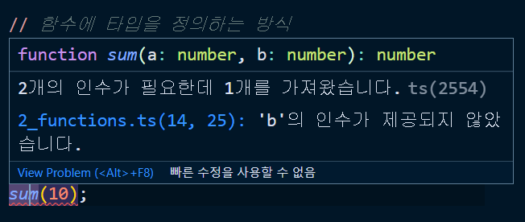
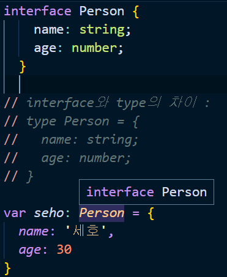
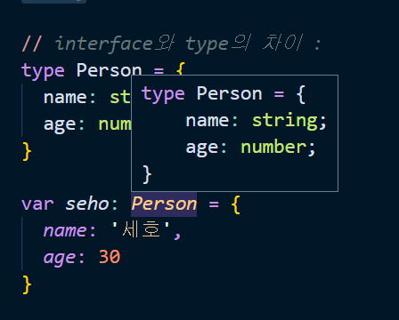
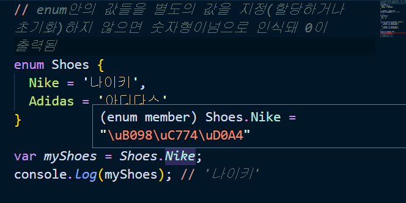
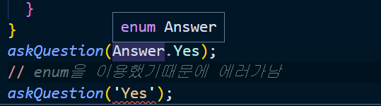
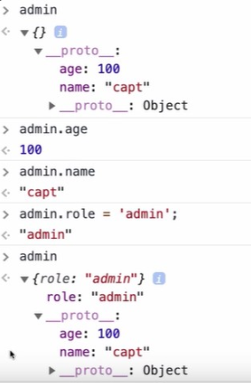
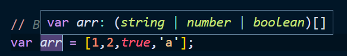

# Typescript 입문 - 기초부터 실전까지

> [Typescript핸드북](https://joshua1988.github.io/ts/intro.html)

[toc]

## Typescript란?

> 타입스크립트는 자바스크립트에 타입을 부여한 언어
>
> 자바스크립트의 확장된 언어라고 볼 수 있다. 
>
> 타입스크립트는 자바스크립트와 달리 브라우저에서 실행하려면 파일을 한번 변환해주어야 한다. 
>
> 이 변환 과정을 우리는 **컴파일(complile)** 이라고 부른다
>
> ```bash
> #터미널에 아래의 코드를 입력
> # node.js 버전 10 이상 설치돼있어야됨
> $ npm i typescript -g
> $ tsc index.ts # typescript파일이 javascript파일로 컴파일됨
> ```

### js에서 typescript쓰는 법

- `index.html`

```html
<!DOCTYPE html>
<html lang="en">
  <head>
    <meta charset="UTF-8" />
    <meta name="viewport" content="width=device-width, initial-scale=1.0" />
    <title>Why Typescript?</title>
  </head>
  <body>
    <h1>사용자 정보</h1>
    <div>
      <p>이름: <span id="username"></span></p>
      <p>이메일: <span id="email"></span></p>
      <p>주소: <span id="address"></span></p>
    </div>
    <!-- axios라이브러리 가져옴 -->
    <script src="https://unpkg.com/axios/dist/axios.min.js"></script>
    <script src="./app.js"></script>
  </body>
</html>

```

- `app.js`

```js
// api url
var url = 'https://jsonplaceholder.typicode.com/users/1';

// dom
var username = document.querySelector('#username');
var email = document.querySelector('#email');
var address = document.querySelector('#address');

// user data
var user = {};

// jsdoc으로 type오류 잡는법

// Address 객체에 대한 정의
/**
 * @typedef {object} Address
 * @property {string} street
 * @property {string} city
 */
// object의 property의 type을 정할 수 있다
/**
 * @typedef {object} User
 * @property {string} name
 * @property {string} email
 * @property {Address} address
 */

// js의 User type 보는 법 
/**
 * @returns {Promise<User>}
 */
function fetchUser() {
  return axios.get(url);
}

fetchUser().then(function (response) {
  // 위에 코드로 object를 정의하면 response에 담긴 data가 어떤 속성이고 type인지 볼 수 있음
  response.address.city;
});

function startApp() {
  // axios
  //   .get(url)
  fetchUser()
    .then(function (response) {
      // console.log(response);
      user = response.data;
      // TODO: 이름, 이메일, 주소 표시하기
      console.log(user);
      username.innerText = user[0].name;
      email.innerText = user[0].email;
      address.innerText = user[0].address.street;
    })
    .catch(function (error) {
      console.log(error);
    });
}

startApp();

```

- `sample.js`

```js
// function sum(a, b) {
//   return a + b;
// }
// js는 숫자와 문자의 합은 문자열로 계산됨
// // sum(10, '20'); // 1020
// var result = sum(10, 20);
// result.toLocalestring();

// 아래 코드 주석아님! '// @ts-check' 이게 있어야 아래의 typescript가 적용됨!
// @ts-check

// param의 type을 정의해줌
/**
 *
 * @param {number} a 첫번째 숫자
 * @param {number} b 두번째 숫자
 */
function sum(a, b) {
  return a + b;
}
// 20도 숫자여야되는데 string이 와서 에러가 바로보임
sum(10, '20');

```

- `sample.ts`

```typescript
// ts는 인수 뒤에 어떤 type인지 적어줌, 그리고 반환해주는 type까지 정의함
function add(a: number, b: number): number {
  return a + b;
}
var result = add(10, 20);
// toLocaleString : 숫자를 문자열로 바꾸는 api
// result.toLocaleString();
// vsCode Intellisence 자동완성으로 오류를 줄임
result.toLocaleString();

// 만약 아래같이 적으면 정해놓은 타입이 아닌 문자열 '20'은 코드상에서 밑줄로 error가 보임
// add(10, '20');

```


### typescript 컴파일

> 타입스크립트를 브라우저가 인식할 수 있게 자바스크립트로 변환 하는 과정을 우리는 **컴파일(complile)** 이라고 부른다

- 컴파일 시 `tsconfig.json`에 옵션을 적을 수 있음

[Typescript공식문서 tsconfig](https://www.typescriptlang.org/tsconfig)

```json
// tsc로 컴파일을 할때 tsconfig.json파일로 옵션을 줄 수있음
{
  "compilerOptions": {
    // 이 프로젝트에 js파일을 허용하겠다
    "allowJs": true,
    // //@ts-check 이 역할과 같은 기능
    "checkJs": true,
    // 최소한의 기본타입 하난 넣어야되는 속성
    // type을  :any라도 적어달란 말
    "noImplicitAny": true
  }
}
```

**예시**

- `index.ts`

```typescript
function sum(a: number, b: number): number {
  return a + b;
}

sum(10, 20);
```

- vsCode 터미널

```bash
#터미널에 아래의 코드를 입력
# node.js 버전 10 이상 설치돼있어야됨
$ npm i typescript -g
$ tsc index.ts # typescript파일이 javascript파일로 컴파일됨
```

- `index.js`파일 생성

```javascript
function sum(a, b) {
    return a + b;
}
sum(10, 20);
```

## Typescript 변수 타입

> [Typescript 변수 타입](https://joshua1988.github.io/ts/guide/basic-types.html)

### 기본타입(문자열, 숫자, 배열, 튜플, 객체, 진위값)

```typescript
// JS 문자열 선언
// var str = 'hello';

// TS 문자열 선언
// str이란 변수 타입은 문자열로 쓰겠다, 보통 let으로 선언
let str: string = 'hello';

// TS 숫자
let num: number = 10;

// TS 배열
// Array안에 <type> : 해당 type만 들어갈 수 있음
let arr: Array<number> = [1,2,3];
// string문자열만 들어가야되는데 10이 들어가서 경고를 보여줌
let heroes: Array<string> = ['Capt', 'Thor', 'Hulk', 10]
// 배열을 '[]'로 표시하고 앞에 type을 적어줘도 동일함
let items: number[] = [1,2,3];

// TS 튜플
// address라는 변수를 type뿐만아니라 해당 위치에 type을 지정할 수 있다.[첫번째 index type string, 2번째 index number가 들어옴]
let address: [string, number] = ['gangnam', 100];

// TS 객체
// typescript 객체 정의 방식
let obj: object = {};
// let person: object = {
//   name: 'capt',
//   age: 100
// };
// person에 각 property에 들어올 type을 지정
let person: { name: string, age: number } = {
  // 각 property에 값을 넣어줌
  name: 'thor',
  age: 1000
}

// TS 진위값
let show: boolean = true;
```

### 함수

> [typescript함수](https://joshua1988.github.io/ts/guide/functions.html#%ED%83%80%EC%9E%85%EC%8A%A4%ED%81%AC%EB%A6%BD%ED%8A%B8%EC%97%90%EC%84%9C%EC%9D%98-%ED%95%A8%EC%88%98)

```typescript
// 함수의 파라미터에 타입을 정의하는 방식
// function sum(a: number, b: number) {
//   return a + b;
// }
// sum(10, 20);

// 함수의 반환 값에 타입을 정의하는 방식
function add(): number {
  return 10;
}

// 함수에 타입을 정의하는 방식
// a:number(a param의 type), b:number(b param의 type) : number(sum함수 return값의 type = 함수 반환값의 type)
function sum(a: number, b: number): number {
  return a + b;
}
sum(10);

// 함수의 옵셔널 파라미터(?)
// ? : 쓰지않아도 된다 라는 옵션 값으로 정의
function log(a: string, b?: string) {

}
// b는 옵션값이기 때문에 없어도 에러가 나지 않음
log('hello world');
log('hello ts', 'abc');
```

- 제대로 작성을 하지 않으면 아래와같이 밑줄이 표시되며, 뭐가 잘못됐는지 알려줌!



## (실습) Todo

> typing : 타입이 정의되지 않은 코드에 타입을 입혀주는 행위

- type을 아직 모를 때 any라도 붙여라 `:any`
- `void` : 반환값이 없다는것을 알려줌

### interface

> 상호간의 약속

- 변수에 인터페이스 활용

```typescript
// 상호간의 규칙을 세움
interface User {
  age: number;
  name: string;
}

// 변수에 인터페이스 활용
// seho라는 변수는 User라는 인터페이스를 갖는다
// 좋은점 : 오탈자를 고치기 쉽고, 다른사람도 항상 동일한 규칙으로 쓸수 있다
var seho: User = {
  age: 33,
  name: '세호'
}
```

- 함수에 인터페이스 활용

```typescript
// 함수에 인터페이스 활용
// 특정형식을 따르는 데이터만 받겠다(User)
function getUser(user: User) {
  console.log(user);
}
const capt = {
  name: '캡틴',
  age: 100
}
// name뿐만아니라 age도 같이 넘겨줘야 오류가 안남! => User 형식에 name과 age가 들어있기 때문
getUser(capt);

// 함수의 스펙(구조)에 인터페이스를 활용
interface SumFunction {
  // 인자 두개 받고, 함수반환타입도 지정
  (a: number, b: number): number;
}
// sum변수에 SumFunction 인터페이스 정의 -> SumFunction의 규칙을 따름
var sumNum: SumFunction;
sumNum = function(a: number, b: number): number {
  return a + b;
}
```

- 인덱싱

```typescript
// 인덱싱
interface StringArray {
  // 배열에 접근할때 index와 그 값의 type을 지정
  [index: number]: string;
}

var arr: StringArray = ['a','b','c'];
// 10은 number이기 때문에 에러가나서 할당이 안됨
// arr[0] = 10;
```

- 딕셔너리 패턴

```typescript
// 딕셔너리 패턴 -> 서비스구현시 많이 씀
// 인덱싱과 유사
interface StringRegexDictionary {
  // 왼쪽의 속성이름은 key, key의 type은 string
  // 값은 정규표현식 RegExp type
  [key: string]: RegExp;
}

var obj: StringRegexDictionary = {
  // sth: /abc/,
  // cssFile의 값은 정규표현식이 와야됨
  // css파일의 정규표현식은 아래와 같이 씀 -> css로 끝나는 파일
  cssFile: /\.css$/,
  jsFile: /\.js$/,
}
// key로 객체에 접근할때 'a'라고 바꾸면 interface에 어긋나기때문에 오류가남, 정규표현식이면 오류가 안나고 바뀜
// obj['cssFile'] = 'a'

Object.keys(obj).forEach(function(value) {});
```

- 인터페이스 확장

```typescript
// 인터페이스 확장
// 인터페이스를 상속받아서 추가하는 것을 확장
interface Person {
  name: string;
  age: number;
}
// 중복된 속성을 Person에서 상속받아 language를 추가(확장)
interface Developer extends Person {
  language: string;
}
// Developer는 Person 인터페이스를 상속받았기 때문에 그 속성값을 다 써줘야 에러가 나지 않는다!
var captain: Developer = {
  language: 'ts',
  age: 100,
  name: '캡틴'
}
```

### type alias(타입 별칭)

> [타입별칭](https://joshua1988.github.io/ts/guide/type-alias.html#%ED%83%80%EC%9E%85-%EB%B3%84%EC%B9%AD-type-aliases)
>
> 타입 별칭은 새로운 타입 값을 하나 생성하는 것이 아니라 정의한 타입에 대해 나중에 쉽게 참고할 수 있게 이름을 부여하는 것과 같다. 이러한 특징은 VSCode 상의 프리뷰 상태로 다른 타입과 어떤 차이점이 있는지 확인해볼 수 있다.
>
> **type vs interface**
>
> **타입 별칭과 인터페이스의 가장 큰 차이점은 타입의 확장 가능 / 불가능 여부**이다. 
>
> 인터페이스는 확장이 가능한데 반해 타입 별칭은 확장이 불가능하다.
>
> 가능한한 `type` 보다는 `interface`로 선언해서 사용하는 것을 추천!!

- 인터페이스로 Person을 지정했을때는 Person에 마우스를 올리면 어떤게 들어가야되는지 바로 나오지 않지만 type으로 지정을 하면 바로 어떤 속성이 들어가야되는지 보임(별칭이기 때문)





```typescript
// interface Person {
//     name: string;
//     age: number;  
//   }
  
// interface와 type의 차이 : 확장 불가능 여부, 가능한 interface를 써라!
type Person = {
  name: string;
  age: number;
}

var seho: Person = {
  name: '세호',
  age: 30
}

type MyString = string;
var str: MyString = 'hello';

type Todo = { id: string; title: string; done: boolean };
function getTodo(todo: Todo) {

}
```

### Operator

#### union type(`|`,or)

> 특정변수에 여러 타입을 쓰고싶을때 union type을 씀
>
> [union type](https://joshua1988.github.io/ts/guide/operator.html#union-type)

```typescript
// any는 어떤 타입이든 가능함
// function logMessage(value: any) {
//   console.log(value);
// }
// logMessage('hello');
// logMessage(100);

// type의 장점을 살라며 다른 type도 지정하는 방법
// |(or) 연산자를 이용, union타입이용(여러 타입을 쓸 수 있게 함)
// 특정변수에 여러 타입을 쓰고싶을때 union type을 씀
var seho: string | number | boolean;
function logMessage(value: string | number) {
  if (typeof value === 'number') {
    // value가 number이기 때문에 .을 했을때 number에 관한 api들이 자동으로 보임
    value.toLocaleString();
  }
  if (typeof value === 'string') {
    // value가 string이기 때문에 .을 했을때 string에 관한 api들이 자동으로 보임
    value.toString();
  }
  // error정리
  throw new TypeError('value must be string or number');
}
logMessage('hello');
logMessage(100);

// 인터섹션(교차) 타입
interface Developer {
  name: string;
  skill: string;
}

interface Person {
  name: string;
  age: number;
}

// 인터섹션(교차) 타입
interface Developer {
  name: string;
  skill: string;
}

interface Person {
  name: string;
  age: number;
}
// union type(|) someone은 'Developer | Person' 이렇게 적으면 someone.을 했을때 접근할 수 있는 속성은 'name'밖에 없음 => why? typescript는 someone이 Developer인지 Person인지 모르기 때문에 보장된 공통된 속성만 접근가능하다.(type safe하지 않기 떄문)보장된 속성이 아니면 타입검증이 없기 때문에 에러가 날수 있다
function askSomeone(someone: Developer | Person) {
  someone.name;
  someone.age;
  someone.skill;
}
// union type에서는 Person이나 Developer가 들어가면 정상작동
askSomeone({name:'디벨로퍼',skill:'웹 개발'});
askSomeone({ name: '캡틴', age: 100 });

```

#### intersection Type(`&`,and)

```typescript
// & 연산자(인터섹션타입) : Developer & Person이라고 하면 두 인터셉터가 가진 모든 속성과 type을 가짐
function askSomeone(someone: Developer & Person) {
  someone.name;
  someone.age;
  someone.skill;
}
// 인터섹션타입을 썼을때는 모든 속성을 다 적어주지 않으면 에러가 발생!
askSomeone({ name: '디벨로퍼', skill: '웹 개발',age:100 })
```

### 이넘(Enums)

> [이넘](https://joshua1988.github.io/ts/guide/enums.html#%EC%9D%B4%EB%84%98-enums)
>
> 이넘은 특정 값들의 집합을 의미하는 자료형

#### 숫자형 이넘

타입스크립트에서 숫자형 이넘은 아래와 같이 선언한다.

```ts
enum Direction {
  Up = 1,
  Down,
  Left,
  Right
}
```

위와 같이 숫자형 이넘을 선언할 때 초기 값을 주면 초기 값부터 차례로 1씩 증가한다.

```text
Up - 1
Down - 2
Left - 3
Right - 4
```

만약 아래와 같이 초기 값을 주지 않으면 0부터 차례로 1씩 증가한다.

```ts
enum Direction {
  Up, // 0
  Down, // 1
  Left, // 2
  Right // 3
}
```

#### 문자형 이넘

- 문자형 이넘은 이넘 값 전부 다 특정 문자 또는 다른 이넘 값으로 초기화 해줘야됨



```typescript
// enum안의 값들을 별도의 값을 지정(할당하거나 초기화)하지 않으면 숫자형이넘으로 인식돼 0이 출력됨
enum Shoes {
  Nike = '나이키',
  Adidas = '아디다스'
}

var myShoes = Shoes.Nike;
console.log(myShoes); // '나이키'

// 예제
enum Answer {
  Yes = 'Y',
  No = 'N',
}
// type을 Answer라는 enum으로 줌
function askQuestion(answer: Answer) {
  // answer가 Answer의 두개의 데이터 중 하나인지 확인
  if (answer === Answer.Yes) {
    console.log('정답입니다');
  }
  if (answer === Answer.No) {
    console.log('오답입니다');
  }
}
askQuestion(Answer.Yes);
// enum을 이용했기때문에 에러가남
askQuestion('Yes');
// askQuestion('예스');
// askQuestion('y');
// askQuestion('Yes');
```




### class

#### (참고) 자바스크립트 `__proto__`

```javascript
var user = {name : 'capt', age:100};
var admin = {};
// admin에 __proto__를 user로 지정하면 admin에 user가 상속돼 접근이 가능해짐
admin.__proto__ = user;
```



- `__proto__`에서 해당 type에 내장돼있는 기능들을 모두 볼 수 있다

- `class.js`

```javascript
function Person(name, age) {
  this.name = name;
  this.age = age;
}
var capt = new Person('캡틴', 100);
// 위의 function Person과 class Person은 같은 뜻
class Person {
  // 클래스 로직
  // constructor : 초기화 메서드
  constructor(name, age) {
    console.log('생성 되었습니다');
    this.name = name;
    this.age = age;
  }
}

var seho = new Person('세호', 30); // 생성 되었습니다.
console.log(seho);
```

- `class.ts`

```typescript
class Person {
  // class에서 사용할 속성들 member변수들의 type도 다 지정해줘야됨
  // class안에서 만 쓸 수있는 private
  private name: string;
  // 기본적으로 다른곳에서도 쓸수있음 public
  public age: number;
  // readonly 접근만 가능하고 바꿀 수 없다
  readonly log: string;
  // typescript이기 때문에 param의 type을 지정해줘야됨
  constructor(name: string, age: number) {
    this.name = name; 
    this.age = age;
  }
}

// 리액트 예전 문법 - 클래스 기반 코드
class App extends React.Component {

}

// 리액트 최신 문법 - 훅 기반의 함수형 코드
function App() {
  return <div>Hello World</div>
}

// 
new Vue({
  el: '',
  setup() {
    
  }
})
```


### 제네릭(Generics)

> 제네릭은 C#, Java 등의 언어에서 재사용성이 높은 컴포넌트를 만들 때 자주 활용되는 특징
>
> 특히, 한가지 타입보다 여러 가지 타입에서 동작하는 컴포넌트를 생성하는데 사용됨
>
> **제네릭이란 타입을 마치 함수의 파라미터처럼 사용하는 것**을 의미

```javascript
// javascript
// text type을 지정하지 않았기 때문에 type:any로 암묵적으로 지정돼있음
// function logText(text) {
//   console.log(text);
//   return text;
// }
// js함수 : type과 관계없이 다 param으로 넘겨줄 수 있음
// logText(10); // 숫자 10
// logText('하이'); // 문자열 하이
// logText(true); // 진위값 true

// 제너릭 이용(호출하는 시점에서 type을 같이 넘겨줌)
// 받는 text의 type을 지정함
// T type으로 넘겨주고 params의 type도 T이고, 반환값도 T
// function logText<T>(text: T): T {
//   console.log(text);
//   return text;
// }
// 함수를 호출할때 text type을 같이 넘겨줄 수있음
// logText에 type을 string으로 넘기겠다
// logText<string>('하이');

// 아래와같이 함수를 여러개 만들지 않아도 제너릭을 이용하면 반복되는 코드를 줄일 수 있다(유지보수에 좋지 않기 때문에 사용)
// function logText(text: string) {
//   console.log(text);
//    //split은 string일때 사용할 수 있는 api
//   // text.split('').reverse().join('');
//   return text;
// }

// function logNumber(num: number) {
//   console.log(num);
//   return num;
// }

// param type을 union으로 받음(여러가지 type이 가능)
// function logText(text: string | number) {
  // 이러면 text는 string과 number의 교집합인 api만 사용가능한 문제가 생김
//   console.log(text);
// 반환값도 string|number가됨
//   return text;
// }

// const a = logText('a');
// logText(10);
// const num = logNumber(10);
// logText(true);

// 제너릭을 이용했을 때 이점
// 각 type의 함수를 여러개 만들어서 지정하는 것이 아니라 타입을 비어놓고 타입을 호출하는 시점에 그 타입에 뭐가 들어갈지 정하는 것이 제너릭
function logText<T>(text: T): T {
  console.log(text);
  return text;
}
// logText 함수의 type을 string으로 하겠다(제너릭)
// const str = logText<string>('abc');
// 이렇게 선언시 split이용가능(string api이기 때문)
// str.split('');
// 동일한 함수에 대해서 boolean값으로 지정도 가능함
// const login = logText<boolean>(true);

// logText('a')
// logText(10)


// 인터페이스에 제네릭을 선언하는 방법
// interface Dropdown {
//   value: string;
//   selected: boolean;
// }

// const obj: Dropdown = { value: 'abc', selected: false };

// 인터페이스에 제너릭 선언
interface Dropdown<T> {
  value: T;
  selected: boolean;
}
// type을 number로 넘겼는데 value값이 string이기 때문에 에러가 남
const obj: Dropdown<number> = { value: 'abc', selected: false };

// 제네릭 타입 제한(제너릭에 더 옵션을 쓰고 싶을때)
// 반환값 T안해줘도되지만 최대한 명시적으로 표시!
// function logTextLength<T>(text: T[]): T[] {
  // 아직 text에 뭐가 들어올지 알수없기때문에 length를 쓰면 오류가남 -> T[]이렇게 배열이 될거라는 힌트를 줌
//   console.log(text.length);
//   text.forEach(function (text) {
//     console.log(text);
//   });
//   return text;
// }
// 배열로 넘겨줘야됨
// logTextLength<string>(['hi', 'abc']);

// 제네릭 타입 제한 2 - 정의된 타입 이용하기
// T[] 이렇게 쓰지 않아도 인터페이스를 이용해 배열인 것을 알려줄 수있다
interface LengthType {
  length: number;
}
// T extends(확장할때사용) LengthType으로 제너릭으로 받은 type은 기본적으로 length라는 속성이 있다는 것을 알려줌
function logTextLength<T extends LengthType>(text: T): T {
  text.length;
  return text;
}
// 10은 length를 제공하지 않기 때문에 에러가 남
logTextLength(10);
// length라는 속성이 들어있으면 사용가능
// 배열,string은 length라는 속성이 들어있기때문에 바로 써주면됨
logTextLength({ length: 10 });

// 제네릭 타입 제한 3 - keyof
interface ShoppingItem {
  name: string;
  price: number;
  stock: number;
}
// ShoppingItem의 key들 중 한가지만 들어갈 수 있게 type 범위를 줄임
function getShoppingItemOption<T extends keyof ShoppingItem>(itemOption: T): T {
  return itemOption;
}
// getShoppingItemOption(10);
// getShoppingItemOption<string>('a');

// key인 name, price, stock만 들어갈 수 있다
getShoppingItemOption('name');

```


#### 제너릭 예제

- `dropdown-generic.html`

```html
<!DOCTYPE html>
<html lang="en">
  <head>
    <meta charset="UTF-8" />
    <meta name="viewport" content="width=device-width, initial-scale=1.0" />
    <title>Document</title>
  </head>
  <body>
    <div>
      <h1>이메일 선택 드롭다운</h1>
      <select id="email-dropdown">
        <!-- typescript에서 배열 반복문을 돌려 붙여줄거야 -->
        <!-- <option value="naver.com" selected>naver.com</option>
        <option value="google.com">google.com</option>
        <option value="hanmail.net">hanmail.net</option> -->
      </select>
    </div>
    <div>
      <h1>상품 수량 선택 드롭다운</h1>
      <select id="product-dropdown">
        <!-- <option value="1" selected>1</option>
        <option value="2">2</option>
        <option value="3">3</option> -->
      </select>
    </div>
  </body>
</html>

```

- `dropdown-generic.ts`

```typescript
// 제너릭을 이용해 interface를 선언
interface DropdownItem<T> {
  value: T;
  selected: boolean;
}

// 인터페이스 선언
// interface Email {
//   value: string;
//   selected: boolean;
// }

// const emails: {value:string; selected:boolean}[]
// const emails: Email[] // 인터페이스 이용
// string을 type으로 넘겨 value값에 string이 들어옴
const emails: DropdownItem<string>[] = [
  { value: 'naver.com', selected: true },
  { value: 'gmail.com', selected: false },
  { value: 'hanmail.net', selected: false },
];

// interface ProductNumber {
//   value: number;
//   selected: boolean;
// }

// interface TrueFalse {
//   value: boolean;
//   selected: boolean;
// }

// type이 number로 넘어가 value값이 number
const numberOfProducts: DropdownItem<number>[] = [
  { value: 1, selected: true },
  { value: 2, selected: false },
  { value: 3, selected: false },
];

// item: Email | ProductNumber 이렇게 인터페이스로 정의도 가능하지만 동일한 속성인데 type이 바껴서 인터페이스를 따로 지정해주는 비효율 적인 것을 제너릭을 이용해 유연하게 만들 수 있다 
// 하나의 interface를 여러개의 type에 적용가능

function createDropdownItem(item: DropdownItem<string> | DropdownItem<number>) {
  const option = document.createElement('option');
  option.value = item.value.toString();
  option.innerText = item.value.toString();
  option.selected = item.selected;
  return option;
}
// 아래와 같이 제너릭을 이용하면 union연산자도 쓰지않고 코드를 줄일 수 있다
// function createDropdownItem<T>(item: DropdownItem<T>) {
// 호출시 <string>을 같이 넘겨주면 됨
// const item = createDropdownItem<string>(email);

// NOTE: 이메일 드롭 다운 아이템 추가
emails.forEach(function (email) {
  const item = createDropdownItem(email);
  const selectTag = document.querySelector('#email-dropdown');
  selectTag.appendChild(item);
});

numberOfProducts.forEach(function (product) {
  const item = createDropdownItem(product);
});

```

### address-book 실습

#### (참고) Promise값 반환

> Promise는 type을 제너릭으로 받게 돼있다

```typescript
// function fetchItems() {
//   let items = ['a', 'b', 'c'];
//   return items; // type추론에 의해 string[]이 return될것을 안다
// }
// let result = fetchItems();
// console.log(result);

// 비동기적 코드(ex. axios 등)
// new Promise가 오면 그안의 type을 알수가 없어 Promise<unknown>으로 뜸, 추론을 할 수가 없다, 그래서 Promise에 의해 반환될 값을 지정해줘야됨 -> string[]으로 type을 지정해줌
function fetchItems(): Promise<string[]> {
  let items: string[] = ['a', 'b', 'c'];
  return new Promise(function (resolve) {
    resolve(items);
  });
}
fetchItems();
```

- `types.ts`

```typescript
interface PhoneNumberDictionary {
  [phone: string]: {
    num: number;
  };
}

interface Contact {
  name: string;
  address: string;
  phones: PhoneNumberDictionary;
}

// 이넘 사용
enum PhoneType {
  Home = 'home',
  Office = 'office',
  Studio = 'studio',
}

export { Contact, PhoneType };

```

- `index.ts`

```typescript
import { Contact, PhoneType } from './types';

// api
// TODO: 아래 함수의 반환 타입을 지정해보세요.
// return type은 Promise 반환 type을 Contact[]로 지정
function fetchContacts(): Promise<Contact[]> {
  // TODO: 아래 변수의 타입을 지정해보세요.
  const contacts: Contact[] = [
    {
      name: 'Tony',
      address: 'Malibu',
      phones: {
        home: {
          num: 11122223333,
        },
        office: {
          num: 44455556666,
        },
      },
    },
    {
      name: 'Banner',
      address: 'New York',
      phones: {
        home: {
          num: 77788889999,
        },
      },
    },
    {
      name: '마동석',
      address: '서울시 강남구',
      phones: {
        home: {
          num: 213423452,
        },
        studio: {
          num: 314882045,
        },
      },
    },
  ];
  return new Promise(resolve => {
    setTimeout(() => resolve(contacts), 2000);
  });
}

// main
class AddressBook {
  // TODO: 아래 변수의 타입을 지정해보세요.
  // type이 Contact인터페이스의 배열
  contacts: Contact[] = [];

  // 초기화 코드를 constructor에 넣어줌
  constructor() {
    this.fetchData();
  }

  fetchData(): void {
    // response의 type은 Contact[], fetchContacts의 return값을 Promise<Contact[]>로 지정했기 때문
    fetchContacts().then(response => {
      this.contacts = response;
    });
  }

  /* TODO: 아래 함수들의 파라미터 타입과 반환 타입을 지정해보세요 */
  // Contact 인터페이스의 name값과 동일한 type string
  // 반환값도 Contact[](filter이기 때문에 조건에 맞는 배열을 반환함)
  findContactByName(name: string): Contact[] {
    return this.contacts.filter(contact => contact.name === name);
  }

  findContactByAddress(address: string): Contact[] {
    return this.contacts.filter(contact => contact.address === address);
  }

  //phoneType : home, office, studio -> 이넘 사용
  findContactByPhone(phoneNumber: number, phoneType: PhoneType): Contact[] {
    return this.contacts.filter(
      // contact의 phones라는 속성 중 어떤 값이든 그 안의 num에 접근
      contact => contact.phones[phoneType].num === phoneNumber
    );
  }
  // findContactByPhone('office');

  addContact(contact: Contact): void {
    this.contacts.push(contact);
  }

  // contact.name값은 string이기 때문에 반환값 string[]
  displayListByName(): string[] {
    return this.contacts.map(contact => contact.name);
  }

  displayListByAddress(): string[] {
    return this.contacts.map(contact => contact.address);
  }
  /* ------------------------------------------------ */
}

let div = document.querySelector('.container') as HTMLDivElement;
div.innerText;

// map이란? => 기존의 값을 변화할 수 있다
// let heroes = [
//   { name: 'Tony', age: 30 },
//   { name: 'Captain', age: 100 },
// ];
// heroes.map(function (hero) {
//   return hero.name;
// }); // ['Tony', 'Captain']

new AddressBook();

```

### type 추론

> [type추론](https://joshua1988.github.io/ts/guide/type-inference.html#%ED%83%80%EC%9E%85-%EC%B6%94%EB%A1%A0-type-inference)
>
>  타입스크립트가 코드를 해석해 나가는 동작을 의미
>
> 변수를 선언하거나 초기화 할 때 타입이 추론됨.
>
> 이외에도 변수, 속성, 인자의 기본 값, 함수의 반환 값 등을 설정할 때 타입 추론이 일어남

```typescript
// 타입 추론 기본 1
var a = 'a'; // a type string으로 type추론에 의해 정의됨

// a의 type은 string 결과값은 :string라고 type추론됨(10 + '10' = '1010'이기때문)
function logA(a = 'a') {
  var b = 10; // b의 type은 number
  return a + b;
}

// 타입 추론 기본 2
interface Dropdown<T> {
  value: T
  title: string;
}
var items: Dropdown<number> = {
  // value 타입도 number라고 추론됨, string적으면 에러남
  value: 10,
  title: 'a'
}

// 타입 추론 기본 3
interface DetailedDropdown<T> extends Dropdown<T> {
  // 인터페이스 확장
  description: string;
  tag: T;
}
var detailItems: DetailedDropdown<number> = {
  // number를 넘겨줬기 때문에 value는 number가 와야됨
  value: 'hi',
  title: 'a',
  description: 'b',
  // tag도 number type이 와야됨
  tag: 'c'
}

// Best Common Type
var arr = [1,2,true,'a'];
```

- `Best Common type`
  - 타입은 보통 몇 개의 표현식(코드)을 바탕으로 타입을 추론한다. 그리고 그 표현식을 이용하여 가장 근접한 타입을 추론하게 되는데 이 가장 근접한 타입을 말함



### 타입 단언(type assertion)

```typescript
// 타입 단언(type assertion)
var a;
a = 20;
a = 'a'
// type을 단언함 b,a둘다 타입이 string
var b = a as string;

// DOM API 조작
// <div id="app">hi</div>

// div의 type은 HTMLDivElement이다
var div = document.querySelector('div');
// div가 없으면 에러가남 이때 타입 단언을 쓸수있음
if (div) {
  div.innerText 
}

// 타입단언
// class가 container인것이 null일 수 있기 때문에 HTMLDivElement로 type을 정함
let div = document.querySelector('.container') as HTMLDivElement;
div.innerText;
```


### 타입 가드

```typescript
interface Developer {
  name: string;
  skill: string;
}

interface Person {
  name: string;
  age: number;
}
// 리턴값 Developer or Person 인터페이스
function introduce(): Developer | Person {
  return { name: 'Tony', age: 33, skill: 'Iron Making' }
}
// tony에 introduce반환값(Developer | Person)을 할당함
var tony = introduce();
// skill이 return값에 있지만 기본적으로 union은 공통된 속성(name)에 접근가능하기 때문에 name밖에 접근이 안됨
console.log(tony.skill);

// 타입단언을 이용하면 접근가능함
// tony type이 Developer로 단언하면 skill에 접근 가능
if ((tony as Developer).skill) {
  var skill = (tony as Developer).skill;
  console.log(skill);
  // tony를 Person으로 단언
} else if ((tony as Person).age) {
  var age = (tony as Person).age;
  console.log(age); 
}
// 이렇게 하면 코드 가독성이 떨어지고 복잡해짐 이때 타입가드를 씀
// 타입 가드 정의(is로 주로 시작)
// target이란 parameter로 DeVeloper 또는 Person을 넘겨주고 target is Developer(넘겨받은 target이 Developer이면 return)
// isDeveloper는 target이 Developer인지아닌지 판별
function isDeveloper(target: Developer | Person): target is Developer {
  return (target as Developer).skill !== undefined;
}

// tony가 Developer이면 skill이 제공됨 그렇지 않으면 Person이기때문에 age가 제공됨
if (isDeveloper(tony)) {
  console.log(tony.skill);
} else {
  console.log(tony.age);
}
```

### 타입 호환(type compatibility)

> [타입호환](https://joshua1988.github.io/ts/guide/type-compatibility.html#%ED%83%80%EC%9E%85-%ED%98%B8%ED%99%98-type-compatibility-%EC%9D%B4%EB%9E%80)
>
> 타입스크립트 코드에서 특정 타입이 다른 타입에 잘 맞는지를 의미

```typescript
// 인터페이스
interface Developer {
  name: string;
  skill: string;
}
// interface Person {
//   name: string;
//   // skill: string;
// }

// var developer: Developer;
// var person: Person;
// person은 name속성밖에 없기때문에 developer에 할당될 수 없음(왼쪽이 구조적으로 더 큰 속성이 있기때문에 호환이 안됨)
// developer = person;
// 반대로 지정하면 에러가 안남(호환이 되기 때문) 왼쪽이 더 작은 구조가 와야됨
// person = developer;

// 인터페이스가 아니라 class로 하더라도 마찬가지! developer = person; 하면 에러남
class Person {
  name: string;
  skill: string;
}

var developer: Developer;
var person: Person;
developer = new Person();
// person = developer;

// 함수
var add = function(a: number) {
  // ...
}
var sum = function(a: number, b: number) {
  // ...
}
// 왼쪽이 더 구조적으로 커야 에러가 안남(호환가능함)
sum = add;
// add = sum; // add는 두개의 인자를 받을 수 없기 때문에 에러가 남

// 제네릭
interface Empty<T> {
  // ..
}
var empty1: Empty<string>;
var empty2: Empty<number>;
empty1 = empty2;
empty2 = empty1;

interface NotEmpty<T> {
  data: T;
}
var notempty1: NotEmpty<string>;
var notempty2: NotEmpty<number>;
// NotEmpty에 data가 있어서 다르기 때문에 호환이 되지 않음
notempty1 = notempty2;
notempty2 = notempty1;
```

## typescript 모듈 시스템

> [모듈시스템](https://joshua1988.github.io/ts/usage/modules.html)
>
> 타입스크립트에서 가리키는 모듈이라는 개념은 [ES6+의 Modules](https://babeljs.io/docs/en/learn#modules) 개념과 유사하다. 모듈은 전역 변수와 구분되는 자체 유효 범위를 가지며 `export`, `import`와 같은 키워드를 사용하지 않으면 다른 파일에서 접근할 수 없다

- `types.ts`

```typescript
// type을 한 파일에 별도로 관리
export interface Todo {
  title: string;
  checked: boolean;
}
```

- `app.ts`

```typescript
// type을 가져옴
import { Todo } from './types'

var item: Todo = {
  title: '할 일 1',
  checked: false,
}
```

### 실습

- `types.ts`

```typescript
interface PhoneNumberDictionary {
  [phone: string]: {
    num: number;
  };
}

interface Contact {
  name: string;
  address: string;
  phones: PhoneNumberDictionary;
}

// 이넘 사용
enum PhoneType {
  Home = 'home',
  Office = 'office',
  Studio = 'studio',
}

// import를 할수있게 내보냄
export { Contact, PhoneType };

```

- `index.ts`

```typescript
// type을 따로 정의하고 불러옴
import { Contact, PhoneType } from './types';

// api
// TODO: 아래 함수의 반환 타입을 지정해보세요.
// return type은 Promise 반환 type을 Contact[]로 지정
function fetchContacts(): Promise<Contact[]> {
  // TODO: 아래 변수의 타입을 지정해보세요.
  const contacts: Contact[] = [
    {
      name: 'Tony',
      address: 'Malibu',
      phones: {
        home: {
          num: 11122223333,
        },
        office: {
          num: 44455556666,
        },
      },
    },
    {
      name: 'Banner',
      address: 'New York',
      phones: {
        home: {
          num: 77788889999,
        },
      },
    },
    {
      name: '마동석',
      address: '서울시 강남구',
      phones: {
        home: {
          num: 213423452,
        },
        studio: {
          num: 314882045,
        },
      },
    },
  ];
  return new Promise(resolve => {
    setTimeout(() => resolve(contacts), 2000);
  });
}

// main
class AddressBook {
  // TODO: 아래 변수의 타입을 지정해보세요.
  // type이 Contact인터페이스의 배열
  contacts: Contact[] = [];

  // 초기화 코드를 constructor에 넣어줌
  constructor() {
    this.fetchData();
  }

  fetchData(): void {
    // response의 type은 Contact[], fetchContacts의 return값을 Promise<Contact[]>로 지정했기 때문
    fetchContacts().then(response => {
      this.contacts = response;
    });
  }

  /* TODO: 아래 함수들의 파라미터 타입과 반환 타입을 지정해보세요 */
  // Contact 인터페이스의 name값과 동일한 type string
  // 반환값도 Contact[](filter이기 때문에 조건에 맞는 배열을 반환함)
  findContactByName(name: string): Contact[] {
    return this.contacts.filter(contact => contact.name === name);
  }

  findContactByAddress(address: string): Contact[] {
    return this.contacts.filter(contact => contact.address === address);
  }

  //phoneType : home, office, studio -> 이넘 사용
  findContactByPhone(phoneNumber: number, phoneType: PhoneType): Contact[] {
    return this.contacts.filter(
      // contact의 phones라는 속성 중 어떤 값이든 그 안의 num에 접근
      contact => contact.phones[phoneType].num === phoneNumber
    );
  }
  // findContactByPhone('office');

  addContact(contact: Contact): void {
    this.contacts.push(contact);
  }

  // contact.name값은 string이기 때문에 반환값 string[]
  displayListByName(): string[] {
    return this.contacts.map(contact => contact.name);
  }

  displayListByAddress(): string[] {
    return this.contacts.map(contact => contact.address);
  }
  /* ------------------------------------------------ */
}
// 타입단언
// class가 container인것이 null일 수 있기 때문에 HTMLDivElement로 type을 정함
let div = document.querySelector('.container') as HTMLDivElement;
div.innerText;

// map이란? => 기존의 값을 변화할 수 있다
// let heroes = [
//   { name: 'Tony', age: 30 },
//   { name: 'Captain', age: 100 },
// ];
// heroes.map(function (hero) {
//   return hero.name;
// }); // ['Tony', 'Captain']

new AddressBook();

```

