# Vue & Typescript

> [Vue.js Typescript공식문서](https://vuejs.org/v2/guide/typescript.html)

[toc]

1. vue cli 버전 업데이트 하라고 뜬다면 업데이트를 해줌

> [Vue CLI](https://cli.vuejs.org/guide/installation.html)
>
> 업데이트가 되지 않는다면 `npm uninstall @vue/cli`(or `yarn remove @vue/cli`)해주고 터미널 창에 `vue`를 쳐봄.
>
> 그래도 아직 뷰가 남아있다면
>
> [npm전역설치경로](https://joshua1988.github.io/webpack-guide/build/npm-module-install.html#npm-%EC%A0%84%EC%97%AD-%EC%84%A4%EC%B9%98)
>
> ```sh
> # window
> %USERPROFILE%\AppData\Roaming\npm\node_modules
> 
> # mac
> /usr/local/lib/node_modules
> ```
>
> 여기에 들어가서 `rm -rf`(리눅스 폴더 또는 파일 삭제 명령어)
>
> ```bash
> $rm -rf @vue
> ```
>
> 이러고 다시 vue를 설치
>
> ```bash
> $ npm install -g @vue/cli
> #or
> $yarn global add @vue/cli
> ```

```bash
$ npm update -g @vue/cli
# or
$ yarn global add @vue/cli
```

2. 프로젝트 생성

> 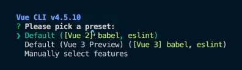
>
> 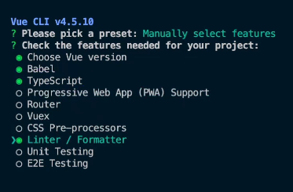
>
> 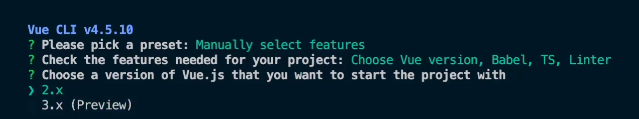
>
> 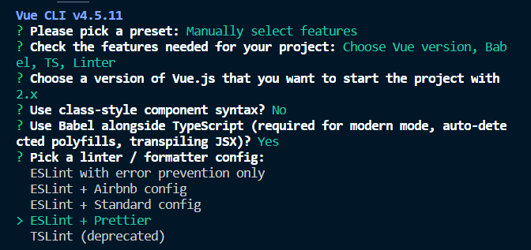
>
> 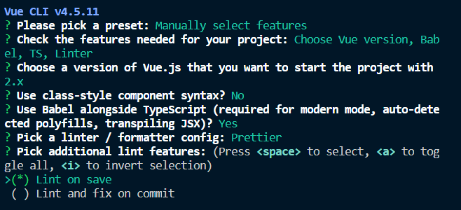
>
> 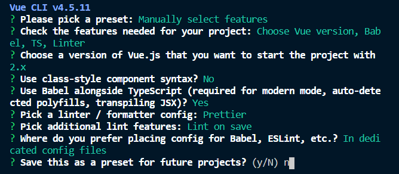
>
> - preset : 뷰 플러그인의 집합
> - 아직까진 현업에선 버전업이 안됐기 때문에 vue2로 배움
> - vue3는 project2에 할건데 typescript를 쓰기엔 더 좋아졌다
> - `In dedicated config files` : 항상 설정파일은 별도로 관리를 하는게 확장성 있게 사용할 수 있다

```bash
$ vue create vue-todo
? Please pick a preset : Manually select features #선택
- CHoose Vue version #default
- Babel #선택(default)
- TypeScript #선택 -> Vue는 Typescript를 직접구현보다 프로젝트 생성 시 Typescript선택
- Progressive Web App (PWA) Support
- Router
- Vuex
- CSS pre-processors
- Linter / Fprmatter # 선택(default)
- Unit Testing
- EXE Testing
? Choose a version ~ 2.x #선택
? Use class-style component syntax? No # class문법을 권장하지 않음 -> 이유는 뒤에나옴
? Use Babel alongside TypeScript (required for modern mode, auto-detected polyfills, transpiling JSX)? YES
? Pick a linter / formatter config: ESLint + Prettier # MS사에서 TSLint말고 eslint로 생태계를 구성하기로 했기 때문에 ESLint 사용!
? Pick additional lint features: Lint on save
? Where do you prefer placing config for Babel, ESLint,etc.? In dedicated config files # 항상 설정파일은 별도로 관리를 하는게 확장성 있게 사용할 수 있다
? Save this as a preset for future projects? No
```

### (참고) Vue에서 Typescript를 사용할 때 Class문법을 권장하지 않는 이유?

> [RFC(Request For Comment)](https://github.com/vuejs/rfcs/pull/17) : Vue의 커뮤니티에서 Class API는 Vue3가 나아가는 방향속에 없다
>
> 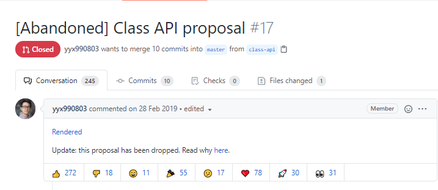
>
> 그리고 Vue3에 추가된 인스턴스 옵션 속성 : setup()
>
> ```js
> setup() {
>   const state = reactive({
>     count: 0
>   })
>   
>   const double = computed(() => state.count * 2)
>   
>   function increment() {
>     state.count++
>   }
>   
>   return {
>     state,
>     double,
>     increment
>   }
> }
> ```

### Vue.js에서 타입스크립트를 적용하는 방법

1. 서비스를 처음 구축할 때 부터 타입스크립트를 사용한다.
2. 기존에 이미 구현된 서비스에 타입스크립트를 점진적으로 적용한다.

## Project1. TO-DO CRUD

**서비스를 처음 구축할 때 부터 타입스크립트를 사용한다.**

> [ts config 파일](https://www.typescriptlang.org/tsconfig/)
>
> `tsconfig.json`
>
> ```json
> {
>   "compilerOptions": {
>     "target": "esnext",
>     "module": "esnext",
>     // strict : true로 하면 noImplicitAny : true로 자동적용
>     "strict": true,
>     "jsx": "preserve",
>     "importHelpers": true,
>     "moduleResolution": "node",
>     "skipLibCheck": true,
>     "esModuleInterop": true,
>     "allowSyntheticDefaultImports": true,
>     "sourceMap": true,
>     "baseUrl": ".",
>     "types": [
>       "webpack-env"
>     ],
>     // jsconfig.json에서(VScode내 설정) 사용했던 절대경로를 tsconfig.json에서(typescript설정) 지정할 수있다
>     "paths": {
>       "@/*": [
>         "src/*"
>       ]
>     },
>     "lib": [
>       "esnext",
>       "dom",
>       "dom.iterable",
>       "scripthost"
>     ]
>   },
>   "include": [
>     "src/**/*.ts",
>     "src/**/*.tsx",
>     "src/**/*.vue",
>     "tests/**/*.ts",
>     "tests/**/*.tsx"
>   ],
>   "exclude": [
>     "node_modules"
>   ]
> }
> ```
>
> - `shims-vue.d.ts`
>   - `.vue` 파일을 모두 Vue타입으로 인식해줘!
>
> ```typescript
> declare module "*.vue" {
>   import Vue from "vue";
>   export default Vue;
> }
> ```

- `App.vue`시작을 할 때 `ts(vbase-ts)`를 선택하면 자동완성으로 vue에서 typescript를 사용할 수 있는 기본 SPA코드가 자동완성됨 

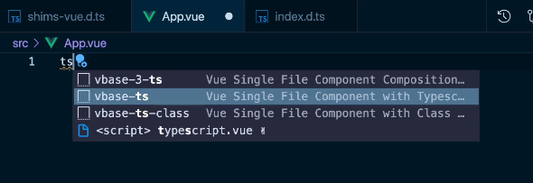

### v-model을 풀어서 구현하는 방식의 장점

> [v-model 글 안내](https://joshua1988.github.io/web-development/vuejs/v-model-usage/)

1. 한국어도 바로바로 적용이 된다
2. 컴포넌트 재사용성이 높아진다
   - 예를들어, TodoInput의 컴포넌트에 `:item="todoText"`와 `@input="updateTodoText"`를 v-model을 풀어서 쓴다면  `:item="password"`와 `@input="updatePassword"` 이렇게 값을 다르게 하면 컴포넌트 활용을 더 잘할 수 있다
3. 그리고 `v-model="todoText"`로도 적용이 가능하다
   - 단, `@input`과 `:value`라고 썼을 때 가능함

### localStorage에 key(vue-todo-ts-v1)와 value(배열)로 저장

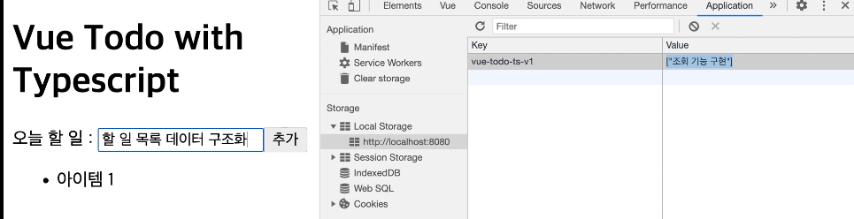

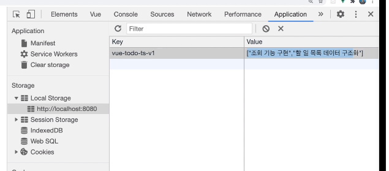

### Vue Todo With Typescript

#### 학습한 내용

- Vue + Typescript 프로젝트 생성 방법

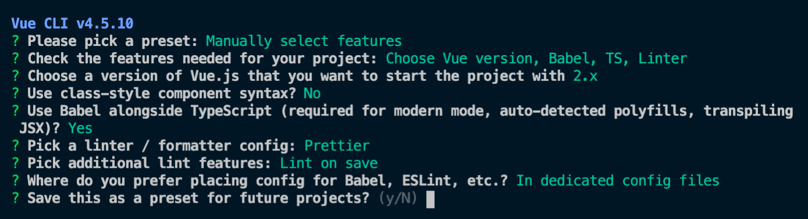

- 뷰 타입스크립트 프로젝트 기본 구조
- 재활용성을 고려한 공통 컴포넌트 설계 방법(인풋, 목록 아이템)
  - 인풋 태그의 한글 입력 처리 방법
- `.vue` 파일에서의 타입스크립트 정의 방식
  - `data`
  - `methods`
  - `props`
  - `computed`
- 타입스크립트를 사용했을 때의 이점

### Code Before vs After

- Vue :`main.js`

```js
import Vue from 'vue'
import App from './App.vue'
import { store } from './store/store.js'

new Vue({
  el: '#app',
  store,
  render: h => h(App)
})

```

- TS : `main.ts`

```typescript
import Vue from "vue";
import App from "./App.vue";

Vue.config.productionTip = false;

new Vue({
  render: h => h(App)
}).$mount("#app");

/**
 * 할 일 관리 앱 (CRUD)
 * - [x] 할 일 추가
 * - [x] 할 일 조회
 * - [x] 할 일 삭제
 * - [x] 할 일 수정
 */

```


- `App.vue`

```vue
// Before
<template>
  <div id="app">
    <TodoHeader></TodoHeader>
    <TodoInput></TodoInput>
    <TodoList></TodoList>
    <TodoFooter></TodoFooter>
  </div>
</template>

<script>
import TodoHeader from './components/TodoHeader.vue'
import TodoInput from './components/TodoInput.vue'
import TodoList from './components/TodoList.vue'
import TodoFooter from './components/TodoFooter.vue'

export default {
  components:{
    // 컴포넌트 태그명 : 컴포넌트 내용
    'TodoHeader':TodoHeader,
    'TodoInput':TodoInput,
    'TodoList':TodoList,
    'TodoFooter':TodoFooter,
  }
 
}
</script>

<style>
#app {
  font-family: Avenir, Helvetica, Arial, sans-serif;
  -webkit-font-smoothing: antialiased;
  -moz-osx-font-smoothing: grayscale;
  text-align: center;
  color: #2c3e50;
  margin-top: 60px;
}
</style>

```

```vue
// After
<template>
  <div>
    <header>
      <h1>Vue Todo with Typescript</h1>
    </header>
    <main>
      <!-- 아래에서 올라온 input emit이벤트를 받아 updateTodoText 메소드 실행-->
      <TodoInput
        :item="todoText"
        @input="updateTodoText"
        @add="addTodoItem"
      ></TodoInput>
      <div>
        <ul>
          <TodoListItem
            v-for="(todoItem, index) in todoItems"
            :key="index"
            :index="index"
            :todoItem="todoItem"
            @toggle="toggleTodoItemComplete"
            @remove="removeTodoItem"
          ></TodoListItem>
          <!-- <li>아이템 1</li>
          <li>아이템 2</li>
          <li>아이템 3</li> -->
        </ul>
      </div>
    </main>
  </div>
</template>

<script lang="ts">
import Vue from "vue";
import TodoInput from "./components/TodoInput.vue";
import TodoListItem from "./components/TodoListItem.vue";
// Storage key를 key값, todoItem 배열을 value에 저장할거다
const STORAGE_KEY = "vue-todo-ts-v1";
// localStorage api 이용(key(상수):value(배열직렬화))
// STORAGE_KEY값으로 조회, 추가
const storage = {
  // todoItem 저장
  save(todoItems: Todo[]) {
    // stringify : 배열을 받아서 문자열로 바꾸고 그 문자열로 바꾼것을 그대로 setItem에 그대로 넣게된다
    const parsed = JSON.stringify(todoItems);
    localStorage.setItem(STORAGE_KEY, parsed);
  },
  // todo 조회
  // fetch의 결과값이 뭔지 정의해줘야됨(Todo배열)
  fetch(): Todo[] {
    // storage_key로 조회, localstorage에 없다면 빈배열([])을 string으로 ("[]")처리해줌 -> 어차피 JSON.parse에 의해 object로 반환되는데 type때문에  에러가나니 그냥 ""붙여줌
    //  todoItems에 저장하고 있다면 배열을 저장함
    const todoItems = localStorage.getItem(STORAGE_KEY) || "[]";
    // 배열로 된것이 json으로 간주되고 object로 반환됨
    // JSON.parse의 todoItems안의 key value는 모두 ""(큰따옴표)로 돼있어야됨
    const result = JSON.parse(todoItems);
    return result;
  }
};
// Todo 객체를 위한 타입 지정
// export를 해야 다른 파일에서도 Todo를 쓸 수 있다
export interface Todo {
  title: string;
  done: boolean;
}

export default Vue.extend({
  components: { TodoInput, TodoListItem },
  // vda : data()속성 자동완성
  data() {
    return {
      todoText: "",
      // todoItems에 들어오는 값은 Todo들이 객체로 들어온다고 타입단언
      todoItems: [] as Todo[]
    };
  },
  methods: {
    // Input에서 올라온 값이 value(string)로 들어옴
    updateTodoText(value: string) {
      this.todoText = value;
    },
    addTodoItem() {
      const value = this.todoText;
      // 이건 그냥 보여주기위해서 적음 나중엔 바로 push안에 적으면 됨
      const todo: Todo = {
        title: value,
        done: false // 아직완료되지 않았으니까 false
      };
      // localStorage에 배열로 저장할 것이기 떄문에 todo를 배열에 넣은 뒤, 저장
      this.todoItems.push(todo);
      storage.save(this.todoItems);
      // localStorage.setItem(value, value);
      this.initTodoText();
    },
    initTodoText() {
      this.todoText = "";
    },
    // items 조회
    fetchTodoItems() {
      // this.todoItems = 1;
      // storage의 fetch로 배열을 가져옴
      // storage.fetch()의 타입을 알기 때문에 a,b의 type을 따로 지정해주지 않아도 됨(타입추론)
      this.todoItems = storage.fetch().sort((a, b) => {
        // sort api 
        // 정렬할 대상은 title(유니코드순)
        // a가 b보다 작을 때 -1
        if (a.title < b.title) {
          return -1;
        }
        // a가 b보다 크면 1
        if (a.title > b.title) {
          return 1;
        }
        // 아니면 0
        return 0;
      });
      return "hi";
    },
    // index를 emit으로 보냄
    removeTodoItem(index: number) {
      console.log("remove", index);
      // index에서 1개를 지우겠다
      this.todoItems.splice(index, 1);
      // 배열이 삭제됐으니 업데이트(다시 저장해줌)
      storage.save(this.todoItems);
    },
    // emit으로 todoItem과 index가 넘어옴
    toggleTodoItemComplete(todoItem: Todo, index: number) {
      this.todoItems.splice(index, 1, {
        // index에 1개를 todoItem에서 done만 toggle(... : spread operator)
        ...todoItem,
        done: !todoItem.done
      });
      // 수정했으니 저장
      storage.save(this.todoItems);
    }
  },
  created() {
    this.fetchTodoItems();
  }
});
</script>

<style scoped></style>
```

- `TodoInput.vue`

```vue
// Before
<template>
  <div class="inputBox shadow">
    <input type="text" v-model="newTodoItem" @keyup.enter="addTodo">
    <span class="addContainer" v-on:click="addTodo">
      <i class="addBtn fas fa-plus" aria-hidden="true"></i>
    </span>

    <Modal v-if="showModal" @close="showModal = false">
      <h3 slot="header">
        경고
        <i class="closeModalBtn fa fa-times"
          aria-hidden="true"
          @click="showModal = false">
        </i>
      </h3>
      <p slot="body">할 일을 입력하세요.</p>
    </Modal>
  </div>
</template>

<script>
import Modal from './common/Modal.vue'

export default {
  data() {
    return {
      newTodoItem: '',
      showModal: false
    }
  },
  methods: {
    addTodo() {
      if (this.newTodoItem !== '') {
        // trim()은 입력된 값의 앞 뒤 공백을 없애줌
        const item = this.newTodoItem.trim();
        // commit을 하면 store.js에 있는 mutation을 실행시키기 위해서!
        this.$store.commit('addOneItem', item);
        this.clearInput();
      } else {
        this.showModal = !this.showModal;
      }
    },
    clearInput() {
      this.newTodoItem = '';
    }
  },
  components: {
    Modal
  }
}
</script>

<style scoped>
input:focus {
  outline: none;
}
.inputBox {
  background: white;
  height: 50px;
  line-height: 50px;
  border-radius: 5px;
}
.inputBox input {
  border-style: none;
  font-size: 0.9rem;
}
.addContainer {
  float: right;
  background: linear-gradient(to right, #6478FB, #8763FB);
  display: block;
  width: 3rem;
  border-radius: 0 5px 5px 0;
}
.addBtn {
  color: white;
  vertical-align: middle;
}
.closeModalBtn {
  color: #42b983;
}
</style>
```

```vue
// After
<template>
  <div>
    <label for="todo-input">오늘 할 일 : </label>
    <!-- @input은 키보드의 input이벤트 -->
    <input id="todo-input" type="text" :value="item" @input="handleInput" />
    <!-- type="button"은 접근성(?)때문에 적음 -->
    <button @click="addTodo" type="button">추가</button>
    
  </div>
</template>

<script lang="ts">
import Vue from "vue";

export default Vue.extend({
  // props: ["item"],
  props: {
    // item이란 type을 정의해줘야됨
    item: {
      type: String,
      // 값은 무조건 있어야됨(필수값)
      required: true
    }
  },
  methods: {
    // input이벤트가 왔을때 App.vue에 emit으로 알려줌
    // event의 InputEvent로 어떻게 추론되는가? 
    handleInput(event: InputEvent) {
      // console.log(event); // target:input인것을 알 수 있다
      // 단언 null이 아니란 것을 알려줘야된다
      // 1) event.target!.value
      // 2) 1)보다 더 safe한 방법
      // if (!event.target) {
      //   return;
      // }
      // 3) 2)를 해도 에러가 난다=> as로 타입단언해주는게 제일 편한 방법(unsafe한 방법이긴하다..)
      const eventTarget = event.target as HTMLInputElement;
      // "input" emit event은 컴포넌트가 대화하기위한 수단
      this.$emit("input", eventTarget.value);
    },
    addTodo() {
      // add emit event올라감
      this.$emit("add");
    }
  }
});
</script>

<style scoped></style>

```

- vue : `TodoList.vue`

```vue
<template>
  <section>
    <transition-group name="list" tag="ul">
      <li v-for="(todoItem, index) in this.storedTodoItems" class="shadow" v-bind:key="todoItem.item">
        <i class="checkBtn fas fa-check" v-bind:class="{checkBtnCompleted: todoItem.completed}" v-on:click="toggleComplete({todoItem, index})"></i>
        <span v-bind:class="{textCompleted: todoItem.completed}">{{ todoItem.item }}</span>
        <span class="removeBtn" v-on:click="removeTodo({todoItem, index})">
          <i class="removeBtn fas fa-trash-alt"></i>
        </span>
      </li>
    </transition-group>
  </section>
</template>

<script>
import { mapGetters, mapMutations } from 'vuex'

export default {
  methods: {
    ...mapMutations({
      removeTodo: 'removeOneItem',
      toggleComplete: 'toggleOneItem'
    })
  },
  computed: {
    ...mapGetters({
      storedTodoItems: 'getTodoItems'
    })
  }
}
</script>

<style scoped>
ul {
  list-style-type: none;
  padding-left: 0px;
  margin-top: 0;
  text-align: left;
}
li {
  display: flex;
  min-height: 50px;
  height: 50px;
  line-height: 50px;
  margin: 0.5rem 0;
  padding: 0 0.9rem;
  background: white;
  border-radius: 5px;
}
.checkBtn {
  line-height: 45px;
  color: #62acde;
  margin-right: 5px;
}
.checkBtnCompleted {
  color: #b3adad;
}
.textCompleted {
  text-decoration: line-through;
  color: #b3adad;
}
.removeBtn {
  margin-left: auto;
  color: #de4343;
}

/* transition css */
.list-enter-active, .list-leave-active {
  transition: all 1s;
}
.list-enter, .list-leave-to /* .list-leave-active below version 2.1.8 */ {
  opacity: 0;
  transform: translateY(30px);
}
</style>

```

- Ts : `TodoListItem.vue`

```vue
<template>
  <li>
    <span class="item" :class="todoItemClass" @click="toggleItem">{{
      todoItem.title
    }}</span>
    <!-- @click="$emit('remove')" 이렇게 바로 emit을 날릴 수 있음 => but 나중에 test할 때 힘듦, 가급적이면 아래 methods에 작성 -->
    <button @click="removeItem">삭제</button>
  </li>
</template>

<script lang="ts">
// Todo interface를 가져와 쓸수 있다
import { Todo } from "@/App.vue";
import Vue, { PropType } from "vue";

export default Vue.extend({
  props: {
    // vue 내부적으로 PropType이란것을 제공함 이건 제너릭을 받기 때문에 원하는 타입을 넘겨줄 수 있다
    todoItem: Object as PropType<Todo>,
    index: Number
  },

  computed: {
    // class가 복잡해졌을때 computed로 만듦(template의 표현식을 단순하게 만들기 위해)
    // computed는 return있기 때문에 반환타입을 적어줘야됨
    // class 반환타입은 string("complete")이거나 null(null)이다
    todoItemClass(): string | null {
      return this.todoItem.done ? "complete" : null;
    }
  },

  methods: {
    toggleItem() {
      this.$emit("toggle", this.todoItem, this.index);
    },
    removeItem() {
      // 몇번째 index인지 가져와서 그걸 토대로 없앰
      this.$emit("remove", this.index);
    }
  }
});
</script>

<style scoped>
.item {
  cursor: pointer;
}
.complete {
  text-decoration: line-through;
}
</style>

```


## Project2. vue-news

**기존에 이미 구현된 서비스에 타입스크립트를 점진적으로 적용한다.**

> ### 뷰 프로젝트에 타입스크립트를 점진적으로 적용하는 방법
>
> 1. Vue + Typescript 프로젝트 생성
>
> 2. 기존 서비스 코드와 라이브러리를 새 프로젝트에 이동
>
> 3. 기본적인 빌드 에러 해결
>
> 4. 타입스크립트의 혜택을 볼 수 있는 주요 파일들 위주로 `.js` -> `.ts`로 변환하며 적용
>
> ***팁 : 타입 체킹 정도는 덜 엄격한 방식에서 점점 엄격한 방식으로 적용하는 것을 추천***

1. `typescript`추가 -> **이러면 에러가 엄청남 이렇게 하지말고 vue cli를 만들고, 원래의 코드를 복붙해오며 점진적으로 바꿈!**

```bash
$ vue add typescript
? Still proceed? Yes
? Use class-style component syntax? No
? Use Babel ~? Yes
? Convert all .js files to .ts? No #모든 js를 ts로 바꾸면 에러가 너무 많이 남 점진적으로 바꿔야됨
? Allow .js files to be compiled? Yes
? Skip type checking of all declaration files? Yes

```

1. vue create

```bash
$ vue create vue-news
```


2. 폴더 복사해서 `src`폴더에 옮기기

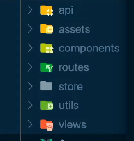

3. `App.vue` 그대로 복붙, `main.js` -> `main.ts`에 복붙, `index.html`복붙

4. `pacakge.json`의 필요한 라이브러리 설치

```bash
$ npm install axios vuex vue-router
```

5. `npm run serve` 와 `npm run build`를 해봄 -> 에러 고쳐나감

6. 점진적으로 바꾸기 위해 `tsconfig.json`의 `strict:false`로 두고 에러를 고쳐나감

7. router 에러를 해결하기 위해 일단  `tsconfig.json`의 `allowJS:true`로 둠
8. 이러면 `npm run serve`에서는 에러가안남
9. `npm run build`를 함 ->  서버에서는 안나지만 build에서는 날 수 있다 -> build에서도 에러가 안나는 것 확인
10. 이제 바꿔나가기 시작함

### App.vue에 타입스크립트 적용 및 strict 옵션 참고 사항

> script만 바꿔주기 위해 `ts`후 `<script> typescript.vue`를 선택

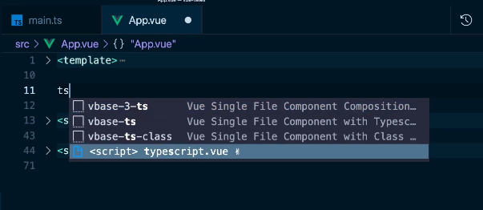

1. strict옵션 하나를 올림 -> `tsconfig.json`파일의 `"noImplicitAny" : true`로 줌(`strict:false`)
2. 서버를 껐다 킴 -> 에러를 고쳐나감

### 유틸성 파일에 TS 적용

1. `utils`폴더의 `bus.js` -> `bus.ts`로 바꿈
2. `bus.js`라고 돼있는 것을 `import bus from "./utils/bus";`로 수정
3. 아래 vs코드 기능으로 다 바꿀수 있음

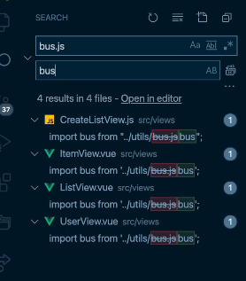

### 주요 TS 적용 

> 에러때문에 화면이 안나오는 것 처리
>
> `vue.config.js`
>
> ```js
> module.exports = {
>   devServer: {
>     overlay: false
>   }
> };
> 
> ```

#### 라우터 파일에 TS 적용 및 라이브러리 내부 타입 선언 파일 설명

1. `index.js`를 `index.ts`로 바꿈 ->  다른 js파일도 차근차근 ts로 바꾸고 에러처리

2. 에러에 마우스올리면 어떻게 고쳐야되는지 나옴 차근차근 고쳐나가면된다

**(참고) strict옵션 true로 바꾼 뒤 error 고쳐나감**

#### API 파일에 타입스크립트 적용 및 호출 로직 구현

1. `api`의 `index.js -> index.ts`

**(참고) api 반환값 AxiosResponse보다 AxiosPromise를 실무에서 더 자주 쓴다** => WHY? 제네릭을 더 줄일 수 있기 때문

(참고) computed속성 활용 이유 => 오타, debugging을 쉽게 하기 위해..

#### 스토어 상태 관리에 대한 주의 사항 안내

> 굳이 스토어를 안써도 되는상황이면 컴포넌트내에서 처리를 해야됨! 스토어에 쓰는게 더 비용낭비!
>
> 예를들어 `Listview`에서 
>
> 1) props로 ListItem으로 넘겨주면 되는 상황이면 store에 안쓰는게 맞고, 
>
> 2) 페이지에 들어가기전에 데이터를 준비하고 싶다면 store에 저장하는게 맞음, 만약 그게아니라면 컴포넌트에서 바로 적어줘야됨!

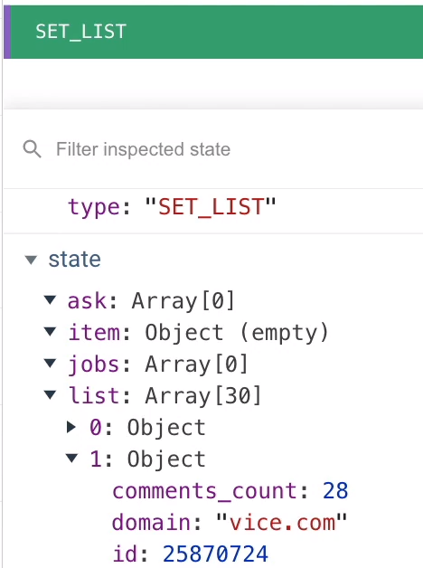

#### 스토어 타입 추론이 안되는 이유?

`$ store`에 `alt`로 자세히 라이브러리로 들어가게 되면 `node_modules/vuex/types/vue.d.ts`에서 보면 **declaration merging(선언병합)** 두번 interface를 쓰게되면 합쳐짐

> ##### [Declaration Merging](https://www.typescriptlang.org/ko/docs/handbook/declaration-merging.html)
>
> “선언 병합”은 컴파일러가 같은 이름으로 선언된 개별적인 선언 두 개를 하나의 정의로 합치는 것을 의미한다. 이 병합된 정의는 원래 두 선언의 특성을 모두 갖는다. 병합할 선언이 몇 개든 병합할 수 있습니다; 두 개의 선언만 합치도록 제한하지 않는다.
>
> ###### 기본 사용법 (Basic Concepts)
>
> TypeScript에서, 선언은 네임스페이스, 타입 또는 값 3개의 그룹 중 적어도 하나의 엔티티를 생성한다. 네임스페이스-생성 선언은 점 표기법을 사용하여 접근할 이름을 가진 네임 스페이스를 생성한다. 타입-생성 선언은 주어진 이름에 바인딩 되고 선언된 형태로 표시된 타입을 생성한다. 마지막으로, 값-생성 선언은 JavaScript에서 확인할 수 있는 출력값을 생성한다.
>
> | 선언 타입     | 네임 스페이스 | 타입 | 값   |
> | :------------ | :------------ | :--- | :--- |
> | 네임 스페이스 | X             |      | X    |
> | 클래스        |               | X    | X    |
> | 열거형        |               | X    | X    |
> | 인터페이스    |               | X    |      |
> | 타입 별칭     |               | X    |      |
> | 함수          |               |      | X    |
> | 변수          |               |      | X    |
>
> 각 선언으로 생성된 결과를 이해하는 것은 선언 병합을 할 때 병합된 결과물을 이해하는 데 도움이 된다.
>
> ###### 인터페이스 병합 (Merging Interfaces)
>
> 가장 단순하고 일반적인 선언 병합의 타입은 인터페이스 병합이다. 가장 기본적인 수준에서, 병합은 두 선언의 멤버를 같은 이름의 단일 인터페이스로 기계적으로 결합한다.
>
> ```typescript
> interface Box {
> height: number;
> width: number;
> }
> interface Box {
> scale: number;
> }
> let box: Box = { height: 5, width: 6, scale: 10 };
> ```
>
> 인터페이스의 비-함수 멤버는 고유해야 한다. 만약 고유하지 않으면, 모두 같은 타입이어야 한다. 인터페이스가 동일한 이름의 함수 멤버를 선언하지만 다른 타입으로 선언하는 경우 컴파일러는 error를 발생시킨다.
>
> 함수 멤버의 경우, 이름이 같은 각 함수 멤버는 같은 함수의 오버로드 하는 것으로 처리한다. 또한 중요한 것은 인터페이스 A와 이후 인터페이스 A를 병합하는 경우에, 두 번째 인터페이스가 첫 번째 인터페이스보다 더 높은 우선순위를 갖게 된다.
>
> 예를 들어:
>
> ```typescript
> interface Cloner {
> clone(animal: Animal): Animal;
> }
> 
> interface Cloner {
> clone(animal: Sheep): Sheep;
> }
> 
> interface Cloner {
> clone(animal: Dog): Dog;
> clone(animal: Cat): Cat;
> }
> ```
>
> 위의 세 인터페이스를 아래와 같은 단일 선언으로 병합할 수 있다:
>
> ```type
> interface Cloner {
> clone(animal: Dog): Dog;
> clone(animal: Cat): Cat;
> clone(animal: Sheep): Sheep;
> clone(animal: Animal): Animal;
> }
> ```
>
> 각 그룹의 요소는 동일한 순서를 유지하지만, 그룹 자체는 나중에 오버로드 될수록 첫 번째에 위치하는 것에 유의.
>
> 이 규칙엔 특수 시그니처(specialized signatures)라는 예외가 존재한다. 만약 단일 문자열 리터럴 타입(예. 문자열 리터럴이 유니온이 아닌 경우)인 매개변수가 있을 경우, 시그니처는 병합된 오버로드 목록의 맨 위로 올라오게 된다.
>
> 예를 들어, 아래의 인터페이스들이 병합된다:
>
> ```typescript
> interface Document {
> createElement(tagName: any): Element;
> }
> interface Document {
> createElement(tagName: "div"): HTMLDivElement;
> createElement(tagName: "span"): HTMLSpanElement;
> }
> interface Document {
> createElement(tagName: string): HTMLElement;
> createElement(tagName: "canvas"): HTMLCanvasElement;
> }
> ```
>
> `Document`의 병합된 선언 결과는 다음과 같다:
>
> ```typescript
> interface Document {
> createElement(tagName: "canvas"): HTMLCanvasElement;
> createElement(tagName: "div"): HTMLDivElement;
> createElement(tagName: "span"): HTMLSpanElement;
> createElement(tagName: string): HTMLElement;
> createElement(tagName: any): Element;
> }
> ```
>
> ###### 네임스페이스 병합 (Merging Namespaces)
>
> 인터페이스와 마찬가지로 같은 이름의 네임스페이스는 네임스페이스 멤버와 병합한다. 네임스페이스가 네임스페이스와 값 둘 다 만들기 때문에, 두 가지가 병합되는 방법을 이해야된다.
>
> 네임스페이스를 병합하기 위해서, 각 네임스페이스에 선언된 export 된 인터페이스로부터 타입 정의가 병합되며, 내부에 병합된 인터페이스 정의가 있는 단일 네임스페이스가 형성된다.
>
> 네임스페이스 값을 병합하려면, 각 선언 위치에 이미 지정된 이름의 네임스페이스가 있을 경우에, 기존 네임스페이스에 두 번째 네임스페이스의 export 된 멤버를 첫 번째에 추가하여 네임스페이스 값이 확장된다.
>
> 이러한 예제인 `Animals` 의 선언 병합:
>
> ```typescript
> namespace Animals {
> export class Zebra {}
> }
> 
> namespace Animals {
> export interface Legged {
>  numberOfLegs: number;
> }
> export class Dog {}
> }
> ```
>
> 다음과 같다:
>
> ```typescript
> namespace Animals {
> export interface Legged {
>  numberOfLegs: number;
> }
> 
> export class Zebra {}
> export class Dog {}
> }
> ```
>
> 이러한 네임스페이스 병합의 모델은 좋은 출발점이지만, 우리는 export 되지 않은 멤버에게 어떤 일이 발생하는지 이해해야 한다. export 되지 않은 멤버는 원래 네임스페이스(병합되지 않은 네임스페이스)에서만 볼 수 있다. 이는 병합 후에 다른 선언으로 병합된 멤버는 export 되지 않은 멤버를 볼 수 없다는 것을 의미힌다.
>
> 아래의 예제에서 더 명확하게 확인할 수 있다:
>
> ```typescript
> namespace Animal {
> let haveMuscles = true;
> 
> export function animalsHaveMuscles() {
>  return haveMuscles;
> }
> }
> 
> namespace Animal {
> export function doAnimalsHaveMuscles() {
>  return haveMuscles; // 오류, haveMuscles가 여기에 접근할 수 없기 때문에
> }
> }
> ```
>
> `haveMuscles` 가 export 되지 않아서, 동일하게 병합되지 않은 네임스페이스를 공유하는 `animalsHaveMuscles` 함수만 이 심벌을 볼 수 있다. `doAnimalsHaveMuscles` 함수가, 병합된 `Animal` 네임스페이스의 멤버일지라도, export 되지 않은 멤버는 볼 수 없다.
>
> ###### 클래스, 함수, 열거형과 네임 스페이스 병합 (Merging Namespaces with Classes, Functions, and Enums)
>
> 네임 스페이스는 다른 타입의 선언과 병합할 수 있을 정도로 유연하다. 이를 위해서, 네임 스페이스 선언은 병합할 선언을 따라야 힌다. 결과 선언은 두 선언 타입의 프로퍼티를 모두 갖는다. TypeScript는 이를 통해 JavaScript와 다른 프로그래밍 언어에서의 패턴을 모델링 힌다.
>
> ###### 네임 스페이스와 클래스 병합 (Merging Namespaces with Classes)
>
> 이 부분은 내부 클래스를 설명하는 방법을 말힌다.
>
> ```typescript
> class Album {
> label: Album.AlbumLabel;
> }
> namespace Album {
> export class AlbumLabel {}
> }
> ```
>
> 병합된 멤버의 가시성 규칙은 [Merging Namespaces](https://www.typescriptlang.org/ko/docs/handbook/declaration-merging.html#merging-namespaces) 세션에서 설명한 것과 같으므로, `AlbumLabel`클래스를 export해야 병합된 클래스를 볼 수 있습니다. 최종 결과는 다른 클래스 내에서 관리되는 클래스다. 또한 네임 스페이스를 사용하여 기존 클래스에 더 많은 정적 멤버를 추가할 수도 있다.
>
> 내부 클래스 패턴 이외에도, JavaScript에서 함수를 생성하고 프로퍼티를 추가함으로써 함수를 확장하는 것에도 익숙할 것이다. TypeScript는 선언 병합을 통해 타입을 안전하게 보존하며 정의할 수 있다.
>
> ```typescript
> function buildLabel(name: string): string {
> return buildLabel.prefix + name + buildLabel.suffix;
> }
> 
> namespace buildLabel {
> export let suffix = "";
> export let prefix = "Hello, ";
> }
> 
> console.log(buildLabel("Sam Smith"));
> ```
>
> 마찬가지로 네임스페이스는 정적 멤버의 열거형을 확장할 수 있다:
>
> ```typescript
> enum Color {
> red = 1,
> green = 2,
> blue = 4,
> }
> 
> namespace Color {
> export function mixColor(colorName: string) {
>  if (colorName == "yellow") {
>    return Color.red + Color.green;
>  } else if (colorName == "white") {
>    return Color.red + Color.green + Color.blue;
>  } else if (colorName == "magenta") {
>    return Color.red + Color.blue;
>  } else if (colorName == "cyan") {
>    return Color.green + Color.blue;
>  }
> }
> }
> ```
>
> ###### 허용되지 않은 병합 (Disallowed Merges)
>
> TypeScript에서 모든 병합이 허용되는 것은 아니다. 클래스는 다른 클래스나 변수와 병합할 수 없다. 클래스 병합을 대체하는 것에 대한 정보는 [Mixins in TypeScript](https://www.typescriptlang.org/docs/handbook/mixins.html) 섹션에서 볼 수 있다.
>
> 
>
> ### Type Augmentation(타입확장)
>
> > [Type Augmentation(타입 확장)](https://www.typescriptlang.org/docs/handbook/declaration-merging.html#module-augmentation)
>
> ###### 모듈 보강 (Module Augmentation)
>
> JavaScript는 모듈 병합을 지원하지 않지만 기존 객체를 import 하고 업데이트함으로써 패치할 수 있다. 쉬운 Observable 예를 살펴보겠다:
>
> ```typescript
> // observable.ts
> export class Observable<T> {
> // ... 연습을 위해 남겨둠 ...
> }
> 
> // map.ts
> import { Observable } from "./observable";
> Observable.prototype.map = function (f) {
> // ... 연습을 위해 남겨둠
> };
> ```
>
> 이는 TypeScript에서 잘 동작하지만, 컴파일러는 `Observable.prototype.map`에 대해 알지 못한다. 모듈 보강을 통해 컴파일러에게 정보를 알려줄 수 있다:
>
> ```typescript
> // observable.ts : vue 내부파일
> export class Observable<T> {
> // ... 연습을 위해 남겨둠 ...
> }
> 
> // map.ts :  ts설정을 프로젝트 단에 새로 정의한 project.d.ts 파일이라고 생각
> import { Observable } from "./observable";
> declare module "./observable" {
> interface Observable<T> {
>  map<U>(f: (x: T) => U): Observable<U>;
> }
> }
> Observable.prototype.map = function (f) {
> // ... 연습을 위해 남겨둠
> };
> 
> // consumer.ts -> 컴포넌트파일이라고 가정
> import { Observable } from "./observable";
> import "./map";
> let o: Observable<number>;
> o.map((x) => x.toFixed());
> ```
>
> 모듈 이름은 `import`/`export`의 모듈 지정자와 같은 방법으로 해석된다. 자세한 내용은 [모듈](https://www.typescriptlang.org/docs/handbook/modules.html)을 참고. 그다음 보강된 선언은 마치 원본과 같은 파일에서 선언된 것처럼 병합된다.
>
> 그러나, 두 가지 제한 사항을 명심해라:
>
> 1. 보강에 새로운 최상위 선언을 할 수 없다 — 기존 선언에 대한 패치만 가능하다.
> 2. Default exports는 보강할 수 없으며, 이름을 갖는 export만 보강할 수 있다(해당 이름으로 확장시켜야 하며, `default`는 예약어다 - 자세한 내용은 [#14080](https://github.com/Microsoft/TypeScript/issues/14080)을 참고)
>
> ###### 전역 보강 (Global augmentation)
>
> 모듈 내부에서 전역 스코프에 선언을 추가할 수 있다:
>
> ```typescript
> // observable.ts
> export class Observable<T> {
>   // ... 연습을 위해 남겨둠 ...
> }
> 
> declare global {
>   interface Array<T> {
>     toObservable(): Observable<T>;
>   }
> }
> 
> Array.prototype.toObservable = function () {
>   // ...
> };
> ```
>
> 전역 보강은 모듈 보강과 동일한 동작과 한계를 가지고 있다.

### store타입정의

> [Vuex Typing](https://joshua1988.github.io/vue-camp/ts/vuex.html#vuex-%EA%B8%B0%EB%B3%B8-%EC%BD%94%EB%93%9C)

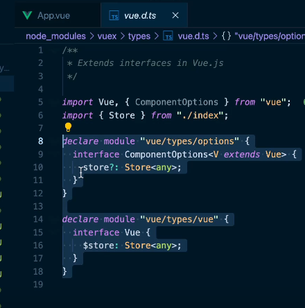

**Store에 any라는 타입을 기준으로 추론이됨 => **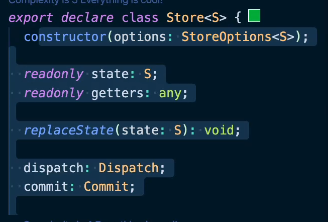

예를들어 이렇게 `S`에 `any`가 들어가면서 다 `any`로 추론이 된다

`state.ts`파일을 만들어

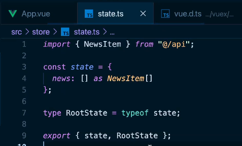

이렇게 `RootState`로 타입을 정의하고, `node_modules > vuex > types > vue.d.ts`(`$store`에 `alt`누르고 클릭하면 이동함)에 제네릭 안에 `RootState`타입을 넣어준뒤 VScode를 껐다 켬


이런식으로 Store뿐만아니라 Mutations, Actions, Getters를 또 바꿔야되는데 

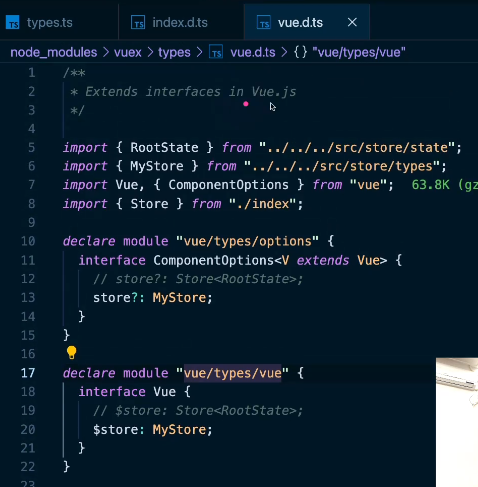

node_modules에 있는 파일을 커스텀하면 프로젝트할때 문제가 생김!

1. 만약 node_modules를 다 지우고 다시 npm install하면 다날아감, 관리가 안됨
2. 프로젝트 할 때 커밋해도 git으로 형상관리가 안됨(gitignore로 node_modules는 제거되기 때문)

#### 커스텀 타입을 프로젝트 레벨로 설정하는 방법

- `types` > `project.d.ts`파일을 생성

```ts
import Vue from "vue";
import { MyStore } from "@/store/types";

// NOTE: `node_module/vuex/types/vue.d.ts` 파일을 삭제해줘야 아래 타입이 정상 추론됨
declare module "vue/types/vue" {
  interface Vue {
    $store: MyStore;
  }
}

declare module "vue/types/options" {
  interface ComponentOptions<V extends Vue> {
    store?: MyStore;
  }
}
```


- `tsconfig.json`파일에 `include`추가

```json
{
"include": [
    "src/**/*.ts",
    "src/**/*.tsx",
    "src/**/*.vue",
    "tests/**/*.ts",
    "tests/**/*.tsx",
    // 타입스크립트 선언 파일이 인식될 수 있게 설정
    // types폴더의 모든 파일의 .d.ts확장자 모두
    "src/types/**/*.d.ts"
  ],
}
```


### (정리)[뷰엑스 타입 정의 방법](https://joshua1988.github.io/vue-camp/ts/vuex.html#%ED%94%84%EB%A1%9C%EC%A0%9D%ED%8A%B8-%ED%83%80%EC%9E%85-%EC%A0%95%EC%9D%98-%ED%99%95%EC%9E%A5%ED%95%98%EA%B8%B0)

> `Vue.extend()` 방식을 이용하여 뷰엑스를 타이핑하려면 뷰엑스 라이브러리 내부적으로 제공하는 타입을 약간 변형해 주어야 합니다. 코드 작성 방식을 알아보기 위해 토큰을 설정하는 뷰엑스 코드를 작성해 보겠습니다.

### Vuex 기본 코드

먼저 `store/index.ts`에 아래와 같이 정의합니다.

```js
// store/index.ts
import Vue from "vue";
import Vuex from "vuex";

Vue.use(Vuex);

const store = {
  state: {
    token: ''
  }
};

export default new Vuex.Store(store);
```

### state 정의

위 기본 코드에서 `state`를 별도의 파일로 분리합니다. `store/state.ts`에 놓겠습니다.

```ts
// store/state.ts
export const state = {
  token: '',
}

export type RootState = typeof state;
```

`state`를 정의한 다음 해당 객체 구조의 타입을 `RootState`의 타입 변수로 선언합니다.

### mutations 정의

뮤테이션 코드도 `store/mutations.ts` 파일에 별도로 작성합니다.

```ts
// store/mutations.ts
import { RootState } from "./state";

// 뮤테이션 타입
export enum MutationTypes {
  SET_TOKEN = "SET_TOKEN",
}

// 뮤테이션 속성 함수
export const mutations = {
  [MutationTypes.SET_TOKEN](state: RootState, token: string) {
    state.token = token;
  },
};

export type Mutations = typeof mutations;
```

추후 뮤테이션 속성 함수의 타입 추론을 위해 뮤테이션 함수의 이름은 모두 `enum` 값으로 선언하고 해당 값을 함수의 이름으로 정의해 줍니다. 앞에서 정의한 `state`의 타입인 `RootState`를 들고 와서 뮤테이션 속성 함수의 첫 번째 파라미터 타입으로 연결해 줬습니다.

### 뷰 컴포넌트에서 활용할 수 있도록 뷰엑스 커스텀 타입 정의

글 서두에 언급한 것처럼 뷰엑스의 내부 타입 방식으로는 위에서 정의한 `state`와 `mutations`가 올바르게 추론되지 않습니다. 이 문제를 해결하기 위해 `store/types.ts`에 아래와 같이 작성합니다.

```ts
// store/types.ts
import { CommitOptions, Store } from "vuex";
import { Mutations } from "./mutations";
import { RootState } from "./state";

type MyMutations = {
  commit<K extends keyof Mutations, P extends Parameters<Mutations[K]>[1]>(
    key: K,
    payload?: P,
    options?: CommitOptions
  ): ReturnType<Mutations[K]>;
};

export type MyStore = Omit<
  Store<RootState>,
  "commit"
> &
  MyMutations
```

위 코드는 뷰엑스 내부적으로 정의된 타입에 우리가 애플리케이션에서 사용하기 위해 작성한 `state`, `mutations` 타입 코드를 추가한 코드입니다. 새로 정의된 `MyStore` 타입을 이제 프로젝트에서 인식할 수 있게만 해주면 됩니다.

뷰엑스 내부 타입이 궁금하신 분들은 `Store` 타입을 쫓아서 들어가보세요 😃

### 프로젝트 타입 정의 확장하기

이제 위에서 정의한 `MyStore` 타입을 아래와 같이 컴포넌트 옵션 속성에서 추론될 수 있게 해보겠습니다.

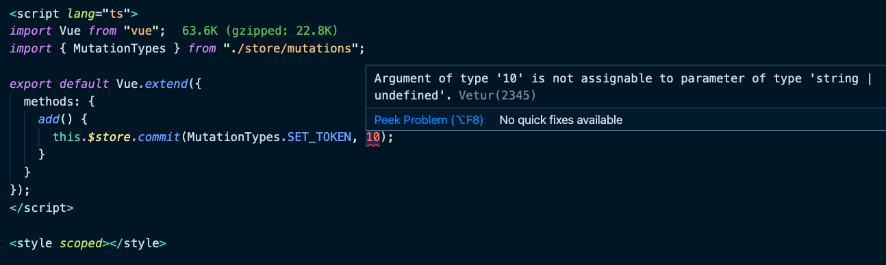

뷰 + 타입스크립트 프로젝트 루트 레벨에 `src/types/project.d.ts` 파일을 생성하고 아래 내용을 작성합니다.

```ts
// src/types/project.d.ts
import Vue from "vue";
import { MyStore } from "../store/types";

declare module "vue/types/vue" {
  interface Vue {
    $store: MyStore;
  }
}

declare module "vue/types/options" {
  interface ComponentOptions<V extends Vue> {
    store?: MyStore;
  }
}
```

다음으로 프로젝트의 타입스크립트 설정 파일에 아래 옵션을 추가합니다.

```js
// ...
"include": [
  "src/**/*.ts",
  "src/**/*.tsx",
  "src/**/*.vue",
  "tests/**/*.ts",
  "tests/**/*.tsx",
  "src/types/**.d.ts",
],
"exclude": [
  // ...
]
```

그리고 `node_modules/vuex/types/vue.d.ts` 파일을 삭제합니다. 이제 사용중인 개발 툴이나 코드 편집기를 종료하고 다시 실행하여 추론이 잘 되는지 확인합니다.

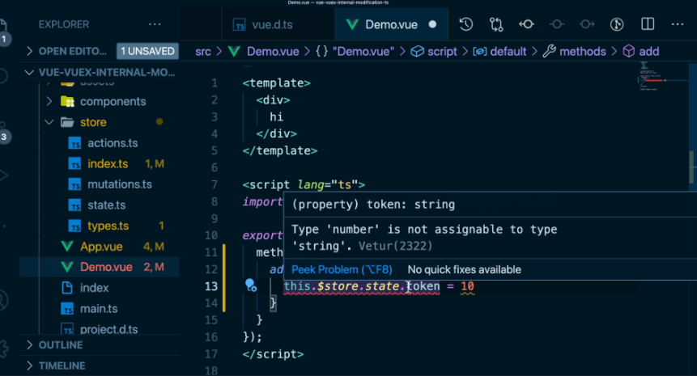

Vue 2에서는 node_modules 밑의 타입 선언 파일을 지워줘야 하지만, Vue 3에서는 내부 라이브러리를 건들지 않고도 확장할 수 있게 다음과 같은 인터페이스가 제공됩니다 😃 [Vuex 4 릴리즈 노트](https://github.com/vuejs/vuex/releases/tag/v4.0.0-beta.1)

### actions 정의

`actions` 함수도 아래와 같이 정의할 수 있습니다.

```ts
// store/actions.ts
import { ActionContext } from "vuex";
import { Mutations } from "./mutations";
import { RootState } from "./state";

export enum ActionTypes {
  FETCH_NEWS = "FETCH_NEWS"
}

interface News {
  title: string;
  id: number;
}

type MyActionContext = {
  commit<K extends keyof Mutations>(
    key: K,
    payload?: Parameters<Mutations[K]>[1]
  ): ReturnType<Mutations[K]>;
} & Omit<ActionContext<RootState, RootState>, "commit">;

export const actions = {
  async [ActionTypes.FETCH_NEWS](context: MyActionContext, payload?: number) {
    const res = await fetch("https://jsonplaceholder.typicode.com/users/1");
    const user: News[] = await res.json();
    return user;
  }
};

export type Actions = typeof actions;
```

스토어 커스텀 타입이 정의된 파일에 아래 내용을 추가합니다.

```ts
// store/types.ts
import { CommitOptions, DispatchOptions, Store } from "vuex";
import { Actions } from "./actions";
import { Mutations } from "./mutations";
import { RootState } from "./state";

type MyMutations = {
  commit<K extends keyof Mutations, P extends Parameters<Mutations[K]>[1]>(
    key: K,
    payload?: P,
    options?: CommitOptions
  ): ReturnType<Mutations[K]>;
};

type MyActions = {
  dispatch<K extends keyof Actions>(
    key: K,
    payload?: Parameters<Actions[K]>[1],
    options?: DispatchOptions
  ): ReturnType<Actions[K]>;
};

export type MyStore = Omit<
  Store<RootState>,
  "commit" | "dispatch"
> &
  MyMutations &
  MyActions;
```

### getters 정의

> 컴포넌트에서 `this.$store.state.news;`라고 바로 쓰는 것을 추천! 굳이 getters를 적을 필요 없음
>
> getters는 코드를 불리기 때문에 실제로는 별로 안쓰임
>
> state, mutation, action은 자주 쓰임

`getters` 속성 함수는 다음과 같이 정의합니다.

```ts
// store/getters.ts
import { RootState } from "./state";

export const getters = {
  getToken(state: RootState) {
    return state.token + "!";
  }
};

export type Getters = typeof getters;
```

스토어 커스텀 파일에 아래와 같이 추가합니다.

```ts
import { Action, CommitOptions, DispatchOptions, Store } from "vuex";
import { Actions } from "./actions";
import { Getters } from "./getters";
import { Mutations } from "./mutations";
import { RootState } from "./state";

type MyMutations = {
  commit<K extends keyof Mutations, P extends Parameters<Mutations[K]>[1]>(
    key: K,
    payload?: P,
    options?: CommitOptions
  ): ReturnType<Mutations[K]>;
};

type MyActions = {
  dispatch<K extends keyof Actions>(
    key: K,
    payload?: Parameters<Actions[K]>[1],
    options?: DispatchOptions
  ): ReturnType<Actions[K]>;
};

type MyGetters = {
  getters: {
    [K in keyof Getters]: ReturnType<Getters[K]>;
  };
};

export type MyStore = Omit<
  Store<RootState>,
  "getters" | "commit" | "dispatch"
> &
  MyMutations &
  MyActions &
  MyGetters;
```

**Vuex 향후 로드맵에 맵 헬퍼 함수가 제거될 거라고 공지가 되어 있습니다. 타입스크립트 추론 관점에서도 맵 헬퍼 함수는 더이상 사용하는 것은 권장하지 않습니다. Vuex 라이브러리의 추가 업데이트 방향에 따라서 관련 내용은 보충할 예정이니 참고해 주세요 :)**


### Project2. Code Before(Vue) Vs After(Ts)

- Before `main.js`

```js
import Vue from 'vue'
import App from './App.vue'
import router from './routes/index.js';
import store from './store/index.js';

Vue.config.productionTip = false

new Vue({
  router,
  store,
  render: h => h(App)
}).$mount('#app')
```

- After `main.ts`

```ts
import Vue from "vue";
import App from "./App.vue";
import router from "./routes/index";
import store from "./store/index";

Vue.config.productionTip = false;

new Vue({
  router,
  store,
  render: h => h(App)
}).$mount("#app");
```

- Before `App.vue`

```vue
<template>
  <div id="app">
    <spinner :loading="loading"></spinner>
    <tool-bar></tool-bar>
    <transition name="routing-fade" mode="out-in">
      <router-view></router-view>
    </transition>
  </div>
</template>

<script>
import ToolBar from './components/ToolBar.vue';
import ProgressBar from './components/ProgressBar.vue';
import Spinner from './components/Spinner.vue';
import bus from './utils/bus.js';

export default {
  components: {
    ToolBar,
    Spinner,
  },
  data() {
    return {
      loading: false,
    }
  },
  methods: {
    onProgress() {
      this.loading = true;
    },
    offProgress() {
      this.loading = false;
    }
  },
  created() {
    bus.$on('on:progress', this.onProgress);
    bus.$on('off:progress', this.offProgress);
  }
}
</script>

<style>
body {
  margin: 0;
}

a {
  color: #34495e;
  text-decoration: none;
}
a:hover {
  color: #42b883;
  text-decoration: underline;
}
a.router-link-active {
  text-decoration: underline;
}

/* Router Transition */
.routing-fade-enter-active, .routing-fade-leave-active {
  transition: opacity .3s ease;
}
.routing-fade-enter, .routing-fade-leave-to
/* .routing-fade-leave-active below version 2.1.8 */ {
  opacity: 0;
}
</style>
```

- After `App.vue`

```vue
<template>
  <div id="app">
    <spinner :loading="loading"></spinner>
    <tool-bar></tool-bar>
    <transition name="routing-fade" mode="out-in">
      <router-view></router-view>
    </transition>
  </div>
</template>

<script lang="ts">
import Vue from "vue";
import ToolBar from "./components/ToolBar.vue";
import Spinner from "./components/Spinner.vue";
import bus from "./utils/bus";
import { MutationTypes } from "./store/mutations";
import { ActionTypes } from "./store/actions";

export default Vue.extend({
  components: {
    ToolBar,
    Spinner
  },
  data() {
    return {
      loading: false
    };
  },
  methods: {
    onProgress() {
      this.loading = true;
    },
    offProgress() {
      this.loading = false;
    }
  },
  async created() {
    this.$store.getters.fetchedNews;
    // state상태를 바꾸는건 mutation에서만 일어나야됨!(에러가남)
    // this.$store.state.news = 10;
    // this.$store.state.news;
    // 10이 아니라 NewsItem[]type이 와야된다고 에러를 보여줌
    // this.$store.commit(MutationTypes.SET_NEWS, 10);
    // 커스텀했기 때문에 dispatch까지 적었을 때 보이는 내용들이 우리가 정의한 코드가 보임
    // const response = await this.$store.dispatch(ActionTypes.FETCH_NEWS);
    bus.$on("on:progress", this.onProgress);
    bus.$on("off:progress", this.offProgress);
  }
});
</script>

<style>
body {
  margin: 0;
}

a {
  color: #34495e;
  text-decoration: none;
}
a:hover {
  color: #42b883;
  text-decoration: underline;
}
a.router-link-active {
  text-decoration: underline;
}

/* Router Transition */
.routing-fade-enter-active,
.routing-fade-leave-active {
  transition: opacity 0.3s ease;
}
.routing-fade-enter, .routing-fade-leave-to
/* .routing-fade-leave-active below version 2.1.8 */ {
  opacity: 0;
}
</style>

```

- Before `routes > index.js`

```js
import Vue from 'vue';
import VueRouter from 'vue-router';
import { ItemView, UserView } from '../views';
import createListView from '../views/CreateListView';
import bus from '../utils/bus.js';
import store from '../store/index.js';

Vue.use(VueRouter);

export default new VueRouter({
  mode: 'history',
  routes: [
    {
      path: '/',
      redirect: '/news' 
    },
    {
      path: '/news',
      name: 'news',
      component: createListView('NewsView'),
      beforeEnter(routeTo, routeFrom, next) {
        bus.$emit('on:progress');
        store.dispatch('FETCH_LIST', routeTo.name)
          .then(next())
          .catch((() => new Error('failed to fetch news items')));
      },
    },
    {
      path: '/ask',
      name: 'ask',
      component: createListView('AskView'),
      beforeEnter(routeTo, routeFrom, next) {
        bus.$emit('on:progress');
        store.dispatch('FETCH_LIST', routeTo.name)
          .then(next())
          .catch((() => new Error('failed to fetch news items')));
      },
    },
    {
      path: '/jobs',
      name: 'jobs',
      component: createListView('JobsView'),
      beforeEnter(routeTo, routeFrom, next) {
        bus.$emit('on:progress');
        store.dispatch('FETCH_LIST', routeTo.name)
          .then(next())
          .catch((() => new Error('failed to fetch news items')));
      },
    },
    {
      path: '/item/:id',
      component: ItemView,
      beforeEnter(routeTo, routeFrom, next) {
        bus.$emit('on:progress');
        const itemId = routeTo.params.id;
        store.dispatch('FETCH_ITEM', itemId)
          .then(() => next())
          .catch(err => new Error('failed to fetch item details', err));
      },
    },
    {
      path: '/user/:id',
      component: UserView,
      beforeEnter(routeTo, routeFrom, next) {
        bus.$emit('on:progress');
        const itemId = routeTo.params.id;
        store.dispatch('FETCH_USER', itemId)
          .then(() => next())
          .catch(err => new Error('failed to fetch user profile', err));
      },
    }
  ]
})
```

- After `routes > index.ts`

```ts
import Vue from "vue";
import VueRouter, { NavigationGuardNext, Route } from "vue-router";
import { ItemView, UserView } from "../views/index";
import createListView from "../views/CreateListView";
import bus from "../utils/bus";
import store from "../store/index";

Vue.use(VueRouter);

export default new VueRouter({
  mode: "history",
  routes: [
    {
      path: "/",
      redirect: "/news"
    },
    {
      path: "/news",
      name: "news",
      component: createListView("NewsView"),
      // 잘만들어진 라이브러리(router)는 내부적으로 router.d.ts(ts선언파일)가 있음
      async beforeEnter(
        // Route 적고 ctrl+space하면 자동완성으로 위에 import됨
        routeTo: Route,
        routeFrom: Route,
        next: NavigationGuardNext<Vue>
      ) {
        // routeTo.name === 1;
        bus.$emit("on:progress");
        // 최대한 최신문법 (async await)를 쓰는 것이 typescript적용을 잘받음
        // try {
        //   await store.dispatch("FETCH_LIST", routeTo.name);
        //   next();
        // } catch (error) {
        //   new Error("failed to fetch news items");
        // 실패했을 때 error처리도 해줌
        //   // next('/error');
        // }
        next();
        // store
        //   .dispatch("FETCH_LIST", routeTo.name)
        //   .then(() => next())
        //   .catch(() => new Error("failed to fetch news items"));
      }
    },
    {
      path: "/ask",
      name: "ask",
      component: createListView("AskView"),
      beforeEnter(routeTo, routeFrom, next) {
        bus.$emit("on:progress");
        store
          .dispatch("FETCH_LIST", routeTo.name)
          .then(() => next())
          .catch(() => new Error("failed to fetch news items"));
      }
    },
    {
      path: "/jobs",
      name: "jobs",
      component: createListView("JobsView"),
      beforeEnter(routeTo, routeFrom, next) {
        bus.$emit("on:progress");
        store
          .dispatch("FETCH_LIST", routeTo.name)
          .then(() => next())
          .catch(() => new Error("failed to fetch news items"));
      }
    },
    {
      path: "/item/:id",
      component: ItemView,
      beforeEnter(routeTo, routeFrom, next) {
        bus.$emit("on:progress");
        const itemId = routeTo.params.id;
        store
          .dispatch("FETCH_ITEM", itemId)
          .then(() => next())
          .catch(err => new Error("failed to fetch item details"));
      }
    },
    {
      path: "/user/:id",
      component: UserView,
      beforeEnter(routeTo, routeFrom, next) {
        bus.$emit("on:progress");
        const itemId = routeTo.params.id;
        store
          .dispatch("FETCH_USER", itemId)
          .then(() => next())
          .catch(err => new Error("failed to fetch user profile"));
      }
    }
  ]
});
```

- `api > index.js`

```js
import axios from 'axios';

const api = {
  news: 'https://api.hnpwa.com/v0/news/1.json',
  ask: 'https://api.hnpwa.com/v0/ask/1.json',
  jobs: 'https://api.hnpwa.com/v0/jobs/1.json',
  user: 'https://api.hnpwa.com/v0/user/',
  item: 'https://api.hnpwa.com/v0/item/'
};

function fetchNews() {
  return axios.get(api.news);
}

function fetchAsk() {
  return axios.get(api.ask);
}

function fetchJobs() {
  return axios.get(api.jobs);
}

function fetchUser(id) {
  const url = `${api.user}${id}.json`;
  return axios.get(url);
}

function fetchItem(id) {
  const url = `${api.item}${id}.json`;
  return axios.get(url);
}

function fetchList(type) {
  const url = `https://api.hnpwa.com/v0/${type}/1.json`;
  return axios.get(url);
}

export {
  fetchNews,
  fetchAsk,
  fetchJobs,
  fetchUser,
  fetchItem,
  fetchList,
}
```

- Before `api > index.ts`

```ts
import axios, { AxiosPromise } from "axios";

const api = {
  news: "https://api.hnpwa.com/v0/news/1.json",
  ask: "https://api.hnpwa.com/v0/ask/1.json",
  jobs: "https://api.hnpwa.com/v0/jobs/1.json",
  user: "https://api.hnpwa.com/v0/user/",
  item: "https://api.hnpwa.com/v0/item/"
};

// network탭에서 복붙해와서 type을 지정해줌
export interface NewsItem {
  comments_count: number;
  domain: string;
  id: number;
  points: number;
  time: number;
  time_ago: string;
  title: string;
  type: string;
  url: string;
  user: string;
}
// AxiosResponse보다 AxiosPromise를 쓰면 제너릭을 좀더 줄일 수 있다
function fetchNews(): AxiosPromise<NewsItem[]> {
  return axios.get(api.news);
}

function fetchAsk() {
  return axios.get(api.ask);
}

function fetchJobs() {
  return axios.get(api.jobs);
}

function fetchUser(id: any) {
  const url = `${api.user}${id}.json`;
  return axios.get(url);
}

function fetchItem(id: any) {
  const url = `${api.item}${id}.json`;
  return axios.get(url);
}

function fetchList(type: any) {
  const url = `https://api.hnpwa.com/v0/${type}/1.json`;
  return axios.get(url);
}

export { fetchNews, fetchAsk, fetchJobs, fetchUser, fetchItem, fetchList };
```

- Before `api > instance > index-instance.js`

```js
import axios from 'axios';
import { setRequestOptions, setResponseOptions } from './intercepter.js';

const APP_BASE_URI = 'https://api.hnpwa.com/v0/';
const options = {};

function create(url, options = {}) {
  const instance = axios.create(Object.assign({ baseURL: url }, options));
  return instance;
}

function createWithAuth(url, options = {}) {
  const instance = axios.create(Object.assign({ baseURL: url }, options));
  setRequestOptions(instance);
  setResponseOptions(instance);
  return instance;
}

const news = create(`${APP_BASE_URI}news/`);
const user = createWithAuth(`${APP_BASE_URI}user/`, options);

export {
  news,
  user,
}
```

- After `api > instance > index-instance.ts`

```ts
import axios, { AxiosInstance } from "axios";
// import { setRequestOptions, setResponseOptions } from "./intercepter.js";

// npm i @types/axios -D

const APP_BASE_URI = "https://api.hnpwa.com/v0/";
const options = {};

function create(url: string, options = {}): AxiosInstance {
  const instance = axios.create(Object.assign({ baseURL: url }, options));
  return instance;
}

function createWithAuth(url: string, options = {}): AxiosInstance {
  const instance = axios.create(Object.assign({ baseURL: url }, options));
  // setRequestOptions(instance);
  // setResponseOptions(instance);
  return instance;
}

const news = create(`${APP_BASE_URI}news/`);
const user = createWithAuth(`${APP_BASE_URI}user/`, options);

export { news, user };
```

- Before `components > ListItem.vue`

```vue
<template>
  <ul class="news-list">
    <li v-for="news in listItems" :key="news.id" class="post">
      <div class="points">
        {{ news.points || 0 }}
      </div>
      <div>
        <p class="news-title">
          <template v-if="news.domain">
            <a :href="news.url">{{ news.title }}</a><small class="link-text" v-if="news.domain">({{ news.domain }})</small>
          </template>
          <template v-else>
            <router-link :to="`/item/${news.id}`">{{ news.title }}</router-link><small><a class="link-text" :href="news.domain" v-if="news.domain">({{ news.domain }})</a></small>
          </template>
        </p>
        <small v-if="news.user" class="link-text">
          by
          <router-link :to="`/user/${news.user}`" class="link-text">{{ news.user }}</router-link>
        </small>
        <small v-if="news.time_ago" class="link-text">
          {{ news.time_ago }}
        </small>
      </div>
    </li>
  </ul>
</template>

<script>
export default {
  computed: {
    listItems() {
      return this.$store.getters.fetchedList;
    }
  }
}
</script>

<style scoped>
.news-list {
  padding: 0;
  margin: 0;
}
.post {
  list-style: none;
  display: flex;
  align-items: center;
  border-bottom: 1px solid #eee;
}
.points {
  width: 80px;
  height: 60px;
  color: #42b883;
  display: flex;
  align-items: center;
  justify-content: center;
}
.link-text {
  color: #828282;
}
.news-title {
  margin: 0;
}
</style>

```

- After `components > ListItem.vue`

```vue
<template>
  <ul class="news-list">
    <li v-for="news in items" :key="news.id" class="post">
      <div class="points">
        {{ news.points || 0 }}
      </div>
      <div>
        <p class="news-title">
          <template v-if="news.domain">
            <a :href="news.url">{{ news.title }}</a
            ><small class="link-text" v-if="news.domain"
              >({{ news.domain }})</small
            >
          </template>
          <template v-else>
            <router-link :to="`/item/${news.id}`">{{ news.title }}</router-link
            ><small
              ><a class="link-text" :href="news.domain" v-if="news.domain"
                >({{ news.domain }})</a
              ></small
            >
          </template>
        </p>
        <small v-if="news.user" class="link-text">
          by
          <router-link :to="`/user/${news.user}`" class="link-text">{{
            news.user
          }}</router-link>
        </small>
        <small v-if="news.time_ago" class="link-text">
          <!-- news.time_ago가 string인것을 알기 때문에 concat함수를 바로 쓴다, 만약 오타가 났거나 할 떄 debugging을 잘하기 위해서 computed에 써야됨  -->
          <!-- {{ news.time_ago.concat(", 2021") }} -->
          {{ timeAgo(news) }}
        </small>
      </div>
    </li>
  </ul>
</template>

<script lang="ts">
import { NewsItem } from "@/api";
import Vue, { PropType } from "vue";

export default Vue.extend({
  // vpr -> props 단축키
  props: {
    items: {
      // PropType은 Vue내부적 제공 type
      type: Array as PropType<NewsItem[]>,
      required: true
    }
  },

  methods: {
    // v-for을 돌렸기 때문에 method로 옴
    timeAgo(news: NewsItem): string {
      return news.time_ago.concat(", 2021");
    }
  },

  computed: {
    // template이 아니라 computed에 작성해야지 훨씬 안정적으로 코드를 작성할 수 있음(하지만 여기서는 v-for를 돌렸기 때문에 method로 가야됨)
    // timeAgo(): string {
    //   return this.items[0].time_ago.concat()
    // },
    // 원래는 store에서 가져왔음
    // listItems(): any {
    //   return this.$store.getters.fetchedList;
    // }
  }
});
</script>

<style scoped>
.news-list {
  padding: 0;
  margin: 0;
}
.post {
  list-style: none;
  display: flex;
  align-items: center;
  border-bottom: 1px solid #eee;
}
.points {
  width: 80px;
  height: 60px;
  color: #42b883;
  display: flex;
  align-items: center;
  justify-content: center;
}
.link-text {
  color: #828282;
}
.news-title {
  margin: 0;
}
</style>

```

- Before `utils > bus.js`

```js
import Vue from 'vue';
// 이벤트 버스는 빈 이벤트 객체를 만들어서 그 이벤트 객체를 통해 컴포넌트간 데이터를 전달하는 것을 의미
// 받는 쪽에서 bus를 선언하면 인스턴스 객체가 들어감
export default new Vue();

// export const bus = new Vue();
// //App.vue
// import { bus } from './bus.js'
// //bus.js
// export default new Vue();
// // App.vue, export defalut를 썼을 때는 뭐를 선언하든지간에 바로 import해서 쓸 수 있음
// import Bus from './bus.js';
```

- After `utils > bus.ts`

```ts
import Vue from "vue";

export default new Vue();
```

- Before `views > index.js` -> After `views > index.ts`이름만 바꿈
- Before `views > CreateListView.js`

```js
import ListView from './ListView.vue';
import bus from '../utils/bus.js';

export default function createListView(name) {
  return {
    name,
    mounted() {
      bus.$emit('off:progress');
    },
    render(h) {
      return h(ListView);
    },
  };
}
```

- After `views > CreateListView.ts`

```ts
import ListView from "./ListView.vue";
import bus from "../utils/bus";
import { CreateElement } from "vue/types/umd";

export default function createListView(name: string) {
  return {
    name,
    mounted() {
      bus.$emit("off:progress");
    },
    // view에서 render function을 이용해서 template에 있는 것들을 변환해줌
    // CreateElement vue에 내부적으로 있는 type
    render(h: CreateElement) {
      return h(ListView);
    }
  };
}
```

- Before `views > ListView.vue`

```vue
<template>
  <div>
    <list-item></list-item>
  </div>
</template>

<script>
import ListItem from '../components/ListItem.vue';
// import bus from '../utils/bus.js';

export default {
  components: {
    ListItem
  },
}
</script>

<style>

</style>

```

- After `views > ListView.vue`

```vue
<template>
  <div>
    <ListItem :items="newsItems"></ListItem>
  </div>
</template>

<script lang="ts">
import Vue from "vue";
import { fetchNews, NewsItem } from "@/api";
import ListItem from "../components/ListItem.vue";

export default Vue.extend({
  components: {
    ListItem
  },

  data() {
    return {
      newsItems: [] as NewsItem[]
    };
  },

  methods: {
    // async await를 쓰면 모든 return값은 Promise! 비동기처리에 실수를 방지할 수 있다(최대한 async await를 써라)
    async fetchNewsItems() {
      const response = await fetchNews();
      this.newsItems = response.data;
    }
  },

  created() {
    this.fetchNewsItems();
  }
});
</script>

<style></style>

```

#### store before

- `store > index.js`

```js
import Vue from 'vue';
import Vuex from 'vuex';
import getters from './getters.js';
import mutations from './mutations.js';
import actions from './actions.js';

Vue.use(Vuex);

export default new Vuex.Store({
  strict: process.env.NODE_ENV !== 'production',
  state: {
    news: [],
    ask: [],
    jobs: [],
    user: {},
    item: {},
    list: [],
  },
  getters,
  mutations,
  actions,
})
```

- `mutations.js`

```js
export default {
  SET_NEWS(state, news) {
    state.news = news;
  },
  SET_ASK(state, ask) {
    state.ask = ask;
  },
  SET_JOBS(state, jobs) {
    state.jobs = jobs;
  },
  SET_USER(state, user) {
    state.user = user;
  },
  SET_ITEM(state, item) {
    state.item = item;
  },
  SET_LIST(state, list) {
    state.list = list;
  },
}
```

- `actions.js`

```js
import {
  fetchNews,
  fetchAsk,
  fetchJobs,
  fetchUser,
  fetchItem,
  fetchList
} from '../api/index.js';

export default {
  FETCH_NEWS({ commit }) {
    return fetchNews().then(response => commit('SET_NEWS', response.data));
  },
  FETCH_ASK({ commit }) {
    return fetchAsk().then(response => commit('SET_ASK', response.data));
  },
  FETCH_JOBS({ commit }) {
    return fetchJobs().then(response => commit('SET_JOBS', response.data));
  },
  FETCH_USER({ commit }, userId) {
    return fetchUser(userId).then(res => commit('SET_USER', res.data));
  },
  FETCH_ITEM({ commit }, itemId) {
    return fetchItem(itemId).then(res => commit('SET_ITEM', res.data));
  },
  // hoc
  FETCH_LIST({ commit }, listType) {
    return fetchList(listType).then(res => commit('SET_LIST', res.data));
  },
}
```

- `getters.js`

```js
export default {
  fetchedItem(state) {
    return state.item;
  },
  fetchedUser(state) {
    return state.user;
  },
  fetchedList(state) {
    return state.list;
  },
  // ItemView
  userName(state) {
    return state.item.user;
  },
  userContent(state) {
    return state.item.content;
  },
  userQuestion(state) {
    return state.item.title;
  },
  userTimeAgo(state) {
    return state.item.time_ago;
  },
  contentPoints(state) {
    return state.item.points;
  },
}
```

#### store After

- `store > index.ts`

```ts
import Vue from "vue";
import Vuex, { mapActions, StoreOptions } from "vuex";
// export default로 꺼낸게 아니면(named export방식) import {} from '' 이런식으로 가져올 수 있다
import { RootState, state } from "./state";
import { mutations } from "./mutations";
import { actions } from "./actions";
// import getters from "./getters.js";
// import mutations from "./mutations.js";
// import actions from "./actions.js";

Vue.use(Vuex);

// StoreOptions<RootState>(Vuex에서 내부적으로 제공하는 type) 이걸 적어주면 store가 제공하는 옵션을 자동완성 할 수있음
const store: StoreOptions<RootState> = {
  // 별도의 파일로 만들어서 모듈화
  // store에서 제공하는 옵션 : 내가 만든 파일이름
  state: state,
  mutations: mutations,
  actions: actions
};

export default new Vuex.Store(store);
// store를 따로 type정의 해줘야 인식이됨(타입추론이 어렵기 때문)
// export default new Vuex.Store({
//   strict: process.env.NODE_ENV !== "production",
//   state: {
//     news: [],
//     ask: [],
//     jobs: [],
//     user: {},
//     item: {},
//     list: []
//   },
//   getters,
//   mutations,
//   actions
// });

```

- `types.ts`

```ts
import { CommitOptions, DispatchOptions, Store } from "vuex";
import { Getters } from "./getters";
import { Actions } from "./actions";
import { Mutations, MutationTypes } from "./mutations";
import { RootState } from "./state";

type MyMutations = {
  // 제네릭을 두개받음 : Mutations의 key를 받겠다, Mutations의 키를 앞에서 받아서 [1] 두번쨰파라미터(첫번째는 state) payload의 타입을 들고오겠다
  commit<K extends keyof Mutations, P extends Parameters<Mutations[K]>[1]>(
    key: K,
    payload?: P,
    options?: CommitOptions // Vuex에서 제공되는 type옵션
  ): ReturnType<Mutations[K]>;
};
// commit(MutationTypes.SET_NEWS, )
// 추론할 수 있는 형태로 변경
type MyActions = {
  dispatch<K extends keyof Actions>(
    key: K,
    payload?: Parameters<Actions[K]>[1],
    options?: DispatchOptions // store내부적으로 있는 type
  ): ReturnType<Actions[K]>;
};

// type A = keyof Getters;
type MyGetters = {
  getters: {
    // 맵드타입
    // key(getters속성함수 key)와 value(getters[key]의 반환타입)로 계속 매칭해줌
    [K in keyof Getters]: ReturnType<Getters[K]>;
  };
};

// Omit은  특정 타입에서 지정된 속성만 제거한 타입을 정의함 ("commit" | "dispatch" | "getters")을 빼주고 합집합으로 MyMutation, MyAction, MyGetters를 포함시켜 MyStore를 확장시킴
export type MyStore = Omit<
  Store<RootState>,
  "commit" | "dispatch" | "getters"
> &
  MyMutations &
  MyActions &
  MyGetters;

// const person = {
//   name: "a",
//   age: 10,
//   skill: "js"
// };
// const josh = Omit<person, 'skill'>
// josh = {
//   name: 'a',
//   age: 10
// }

// 인터섹션(합집합)
// type A = {
//   name: string;
// };
// type B = {
//   age: number;
// };
// & : A와 B에 들어간 속성이 모두 들어가야됨
// type C = A & B;
// const person: C = {
//   name: "a"
//   // age: 10
// };

```

- `state.ts`

```ts
import { NewsItem } from "@/api";

const state = {
  news: [] as NewsItem[]
};

// node_modules/vuex/types/vue.d.ts에 연결해서 바로 추론되게 했었음(결국 나중엔 따로 파일 만들어서 프로젝트에 쓰일 수 있게 만듦 => project.d.ts)
// 나중에는 State도 모듈화 되기 때문에 RootState라고 보통 명명을 많이 함
type RootState = typeof state;

// named export방식
export { state, RootState };

```

- `mutations.ts`

```ts
import { NewsItem } from "@/api";
import store from ".";
import { RootState } from "./state";

// enum은 나중에 코드가 많아지면 자동완성으로 편하게 코드를 빠르게 칠수 있다
enum MutationTypes {
  SET_NEWS = "SET_NEWS"
}

// store.commit("setNews");

const mutations = {
  // 이넘에 의해 "SET_NEWS"가 들어옴
  [MutationTypes.SET_NEWS](state: RootState, news: NewsItem[]) {
    state.news = news;
  }
};
// mutations가 타입으로 담겨야지 store에서 추론을 할 수있다
// 주의!!! Mutation's' s를 안붙이면 Vuex 내부적으로 쓰고있는 타입 이름인 Mutation과 겹치기 때문에 s를 붙여줘야된다.
type Mutations = typeof mutations;

export { MutationTypes, mutations, Mutations };

// export default {
//   SET_NEWS(state, news) {
//     state.news = news;
//   },
//   SET_ASK(state, ask) {
//     state.ask = ask;
//   },
//   SET_JOBS(state, jobs) {
//     state.jobs = jobs;
//   },
//   SET_USER(state, user) {
//     state.user = user;
//   },
//   SET_ITEM(state, item) {
//     state.item = item;
//   },
//   SET_LIST(state, list) {
//     state.list = list;
//   }
// };

```

- `actions.ts`

```ts
import { fetchNews, NewsItem } from "@/api";
import { ActionContext } from "vuex";
import { Mutations, MutationTypes } from "./mutations";
import { RootState } from "./state";

enum ActionTypes {
  FETCH_NEWS = "FETCH_NEWS"
}
// ActionContext를 확장시킴
// type이 store 내부적으로 아직 확장이 잘 안돼있어서 확장시킴
type MyActionContext = {
  commit<K extends keyof Mutations>(
    key: K,
    payload: Parameters<Mutations[K]>[1]
  ): ReturnType<Mutations[K]>;
  // ActionContext는 제네릭으로 두개를 받음 첫번째는 state, 두번째는 rootState에 들어가는 제네릭
} & Omit<ActionContext<RootState, RootState>, "commit">;

const actions = {
  async [ActionTypes.FETCH_NEWS](context: MyActionContext, payload?: any) {
    // payload는 거의 사용하지않음 옵션
    const { data } = await fetchNews();
    context.commit(MutationTypes.SET_NEWS, data);
    return data; // dispatch를 했을 때 response의 반환값은 NewsItem[]이라고 추론됨
  }
};

type Actions = typeof actions;

export { ActionTypes, actions, Actions };
// this.$store.dispatch(ActionTypes.FETCH_NEWS)

// import {
//   fetchNews,
//   fetchAsk,
//   fetchJobs,
//   fetchUser,
//   fetchItem,
//   fetchList
// } from "../api/index";

// export default {
//   FETCH_NEWS({ commit }) {
//     return fetchNews().then(response => commit("SET_NEWS", response.data));
//   },
//   FETCH_ASK({ commit }) {
//     return fetchAsk().then(response => commit("SET_ASK", response.data));
//   },
//   FETCH_JOBS({ commit }) {
//     return fetchJobs().then(response => commit("SET_JOBS", response.data));
//   },
//   FETCH_USER({ commit }, userId) {
//     return fetchUser(userId).then(res => commit("SET_USER", res.data));
//   },
//   FETCH_ITEM({ commit }, itemId) {
//     return fetchItem(itemId).then(res => commit("SET_ITEM", res.data));
//   },
//   // hoc
//   FETCH_LIST({ commit }, listType) {
//     return fetchList(listType).then(res => commit("SET_LIST", res.data));
//   }
// };

```

- `getters.ts`

```ts
import { RootState } from "./state";

export const getters = {
  fetchedNews(state: RootState) {
    return state.news;
  }
};

export type Getters = typeof getters;

// export default {
//   fetchedItem(state) {
//     return state.item;
//   },
//   fetchedUser(state) {
//     return state.user;
//   },
//   fetchedList(state) {
//     return state.list;
//   },
//   // ItemView
//   userName(state) {
//     return state.item.user;
//   },
//   userContent(state) {
//     return state.item.content;
//   },
//   userQuestion(state) {
//     return state.item.title;
//   },
//   userTimeAgo(state) {
//     return state.item.time_ago;
//   },
//   contentPoints(state) {
//     return state.item.points;
//   }
// };

```

- `types > project.d.ts`

```ts
import Vue from "vue";
import { MyStore } from "@/store/types";

// [Vue2기준] NOTE: `node_module/vuex/types/vue.d.ts` 파일을 삭제해줘야 아래 타입이 정상 추론됨
// Module Augmentation(declare module) : Vue내부적 type에 대한 확장을 프로젝트 레벨에서 했기 때문에 정의된 type을 추론할 수있다
declare module "vue/types/vue" {
  interface Vue {
    $store: MyStore;
  }
}

declare module "vue/types/options" {
  interface ComponentOptions<V extends Vue> {
    store?: MyStore;
  }
}
```


-----

## Project3. Chartjs

1. 라이브러리 설치

```bash
npm install chart.js --save
```

2. Chart.js의 공식문서에서 chart를 `App.vue`의 `mounted`에 넣고 타입스크립트로 바꿈	
3. 차트 라이브러리 플러그인화

- `chart.js`라이브러리를 인식하기위해 ts선언파일이 필요함 or `npm install @types/chart.js`를 찾아서 코드적음(`npm install --save @types/chart.js`)
- [TypeScript Type Search](https://www.typescriptlang.org/dt/search?search=)여기서 `chart.js`이게 찾아지지 않는다면 플러그인으로 따로 만들어 줘야됨
- `plugins` > `ChartPlugin.ts`파일을 만들어 라이브러리 선언파일을 만들어줌

```ts
import Chart from "chart.js";
import { VueConstructor } from "vue/types/umd";

export default {
  // VueConstructor : vue내부타입
  install(Vue: VueConstructor) {
    // $_Chart는 플러그인의 적합한 네임컨벤션 -> .eslintrc.js에서  "@typescript-eslint/camelcase": "off"로 camelcase를 꺼줘서 $_Chart 이름을 쓸 수 있게 함
    Vue.prototype.$_Chart = Chart;
  }
};

// App.vue
// new this.$_Chart(); //이렇게 chart를 생성할 수 있다

```

- `.eslintrc.js`

```js
module.exports = {
  root: true,
  env: {
    node: true
  },
  extends: [
    "plugin:vue/essential",
    "eslint:recommended",
    "@vue/typescript/recommended",
    "@vue/prettier",
    "@vue/prettier/@typescript-eslint"
  ],
  parserOptions: {
    ecmaVersion: 2020
  },
  rules: {
    "no-console": process.env.NODE_ENV === "production" ? "warn" : "off",
    "no-debugger": process.env.NODE_ENV === "production" ? "warn" : "off",
    // off, warn, error가 있는데 off로 camelcase를 꺼줘서 $_Chart 이름을 쓸 수 있게 함
    "@typescript-eslint/camelcase": "off"
  }
};
```

- `types > project.d.ts`
  - `tsconfig.json`에 `include`에 ` "src/**/\*.d.ts" // 이걸 추가해도되고 자동으로 적용됨`

```typescript
// 1. Make sure to import 'vue' before declaring augmented types
import Vue from "vue";
// chart.js 라이브러리가 export = Chart로 export했기 때문에 import는 require()을 써야됨
import Chart = require("chart.js");
// 대부분은 아래와 같이 import, chart.js가 특수한 상황
// import Chart from 'chart.js'

// $_Chart의 Chart를 이용해  Chart 클래스의 타입을 만듦
type ChartLib = typeof Chart;

// 2. Specify a file with the types you want to augment
//    Vue has the constructor type in types/vue.d.ts
declare module "vue/types/vue" {
  // 3. Declare augmentation for Vue
  interface Vue {
    // $_Chart: any; // 일단 처음엔 any로 타입을 시작함
    $_Chart: ChartLib;
  }
}

// @types 라이브러리가 제공되지 않는 라이브러리의 경우
// declare module "라이브러리 이름";

```

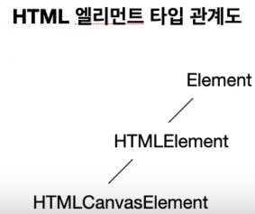

- `App.vue`

```vue
<template>
  <div>
    <canvas id="myChart"></canvas>
  </div>
</template>

<script lang="ts">
import Vue from "vue";
// import Chart from "chart.js";

export default Vue.extend({
  mounted() {
    //  document.getElementById("myChart")이게 canvas element라고 타입단언을 해줌
    const canvasElement = document.getElementById(
      "myChart"
    ) as HTMLCanvasElement;
    const ctx = canvasElement.getContext("2d");
    // null값처리
    if (!ctx) {
      return;
    }
    // 플러그인을 이용해 import를 하지않고 main.ts에 플러그인을 등록했으니 this.$_Chart로 사용할 수 있다
    const chart = new this.$_Chart(ctx, {
      // The type of chart we want to create
      type: "line",

      // The data for our dataset
      data: {
        labels: [
          "January",
          "February",
          "March",
          "April",
          "May",
          "June",
          "July"
        ],
        datasets: [
          {
            label: "My First dataset",
            backgroundColor: "rgb(255, 99, 132)",
            borderColor: "rgb(255, 99, 132)",
            data: [0, 10, 5, 2, 20, 30, 45]
          }
        ]
      },

      // Configuration options go here
      options: {}
    });
  }
});
</script>

<style scoped></style>

```


#### (참고)`export =` and `import = require()`

> [export = 문법](https://www.typescriptlang.org/docs/handbook/modules.html#export--and-import--require)

- 예시

  - `ZipCodeValidator.ts`

  ```ts
  let numberRegexp = /^[0-9]+$/;
  class ZipCodeValidator {
    isAcceptable(s: string) {
      return s.length === 5 && numberRegexp.test(s);
    }
  }
  export = ZipCodeValidator;
  ```

  - `Test.ts`

  ```ts
  import zip = require("./ZipCodeValidator");
  // Some samples to try
  let strings = ["Hello", "98052", "101"];
  // Validators to use
  let validator = new zip();
  // Show whether each string passed each validator
  strings.forEach((s) => {
    console.log(
      `"${s}" - ${validator.isAcceptable(s) ? "matches" : "does not match"}`
    );
  });
  ```

  